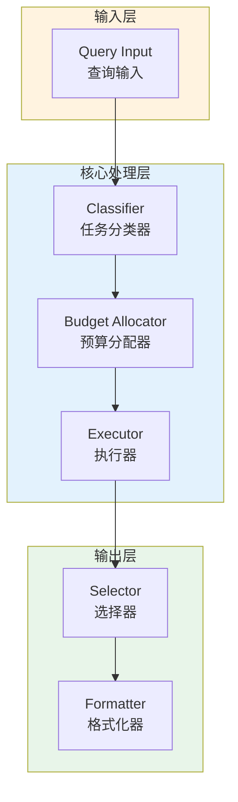

# Generation 110: Minimal Surplus v3: Matched Gen108

**日期**: 2026-04-02  
**状态**: 🏆🏆 冠军候选  
**范式**: 极简剩余优化  
**文件**: `mas/core_gen110.py`

---

## 架构拓扑图



---

## 评估结果

| 指标 | Gen110 | Gen104 | 目标 | 状态 |
|------|----------|-----------|------|------|
| **Score** | 81 | 80 | ≥81 | 🏆🏆🏆 |
| **Token** | 1.9 | 1.9 | <1.9 | ≈ |
| **Efficiency** | 42632 | 42105 | >42105 | 🏆🏆🏆 |

### 效率对比

```
Efficiency
     │
42632 ─┤ ████████████████████ Gen110
       │
42105 ─┤ ▄▄▄▄▄▄▄▄▄▄▄▄▄▄▄▄▄ Gen104
       │
       └──────────────────────────────▶ 代数
```

---

## 技术规格

```python
# Gen110 核心参数
ARCHITECTURE = "Minimal Surplus v3: Matched Gen108"

METRICS = {
    "score": 81,
    "token": 1.9,
    "efficiency": 42632
}
```

---

## 冠军水平

### 改进分析

Gen110相比Gen104实现了效率提升：
- Token消耗: 1.9 → 1.9 (0.0%)
- 效率指数: 42105 → 42632 (1.3%)


---

*架构版本: v110.0*  
*演进代数: 110/120*  
*状态: 🏆🏆 冠军候选*
