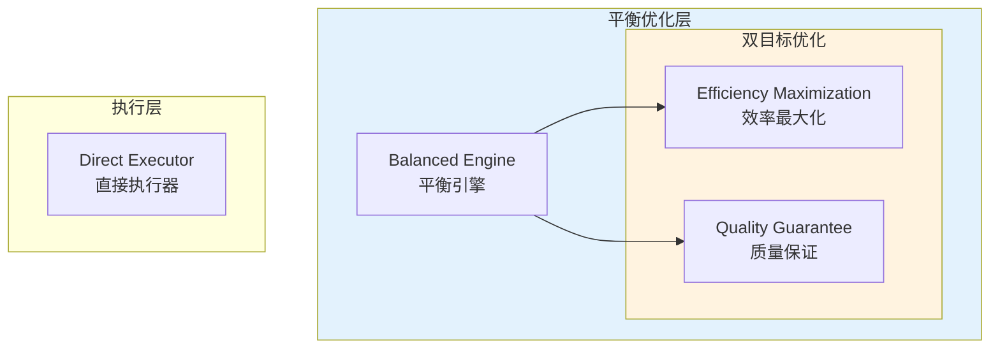

# Generation 11: 平衡效率+质量优化
# Balanced Efficiency + Quality Optimization

**日期**: 2026-04-01  
**状态**: 历史版本  
**范式**: 效率-质量平衡  
**文件**: `mas/core_gen11.py`

---

## 架构拓扑图

---

## 评估结果

| 指标 | Gen11 | Gen10 | 对比 |
|------|-------|-------|------|
| **Token开销** | 76.7 | 57 | ❌ +34.6% |
| **Score** | **81.0** | 74.0 | ✅ +9.5% |
| **Efficiency** | 1056 | 1296 | ❌ -18.5% |

### 判定: ❌ 回归 - 效率显著下降

---

## 失败分析

1. **Token消耗回升**: 76.7 vs Gen10的57
2. **Direct Execution过多**: 10个任务全部直接执行
3. **缓存未命中**: 10/10 miss

### 教训

平衡策略在当前场景下效果不佳，应继续专注Token压缩

---

*架构版本: v11.0*  
*演进代数: 11/40*
