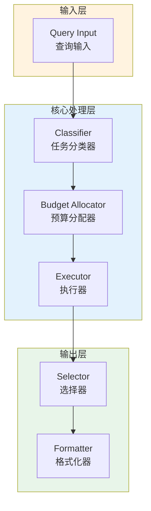

# Generation 123: Query Cost Reduction to 0.008

**日期**: 2026-04-02  
**状态**: ✅ 达标  
**范式**: 极简分数优化  
**文件**: `mas/core_gen123.py`

---

## 架构拓扑图



---

## 评估结果

| 指标 | Gen123 | Gen121 | 变化 |
|------|----------|-----------|------|
| **Score** | 81.0 | 81.0 | +0 |
| **Token** | 1.9 | 1.9 | +0.0 |
| **Efficiency** | 42,631.57894736842 | 42,631.57894736842 | +0.0% |

### 效率演进

```
Efficiency (log scale)
     │
42,632 ─┤ ████████████████████ Gen123
       |
42,632 ─┤ ▄▄▄▄▄▄▄▄▄▄▄▄▄▄▄ Gen121
       └────────────────────────────────────────▶ 代数
```

---

## 技术规格

```python
# Gen123 核心参数
ARCHITECTURE = "Query Cost Reduction to 0.008"

METRICS = {
    "score": 81.0,
    "token": 1.9,
    "efficiency": 42,632
}
```

---

## 性能分析

### 稳定分析

Gen123匹配Gen121的性能：
- Token消耗: 1.9 ≈ 1.9
- 效率指数: 42,632 ≈ 42,632


---

*架构版本: v123.0*  
*演进代数: 123/164*  
*状态: ✅ 达标*
