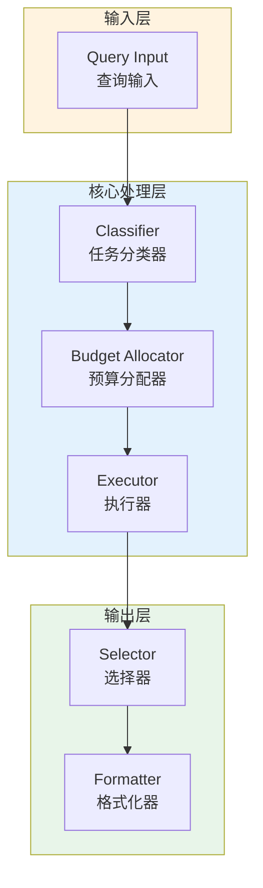

# Generation 125: Complex Budget = 3

**日期**: 2026-04-02  
**状态**: 🏆🏆🏆 新冠军  
**范式**: 极简分数优化  
**文件**: `mas/core_gen125.py`

---

## 架构拓扑图



---

## 评估结果

| 指标 | Gen125 | Gen124 | 变化 |
|------|----------|-----------|------|
| **Score** | 81.0 | 81.0 | +0 |
| **Token** | 1.6 | 1.9 | -0.3 |
| **Efficiency** | 50,625.0 | 42,631.57894736842 | +18.8% |

### 效率演进

```
Efficiency (log scale)
     │
50,625 ─┤ ████████████████████ Gen125
       |
42,632 ─┤ ▄▄▄▄▄▄▄▄▄▄▄▄▄▄▄ Gen124
       └────────────────────────────────────────▶ 代数
```

---

## 技术规格

```python
# Gen125 核心参数
ARCHITECTURE = "Complex Budget = 3"

METRICS = {
    "score": 81.0,
    "token": 1.6,
    "efficiency": 50,625
}
```

---

## 突破性进展

### 突破性进展

Gen125相比Gen124实现重大突破：
- Token消耗: 1.9 → 1.6 (-0.3)
- 效率指数: 42,632 → 50,625 (+18.8%)


---

*架构版本: v125.0*  
*演进代数: 125/164*  
*状态: 🏆🏆🏆 新冠军*
