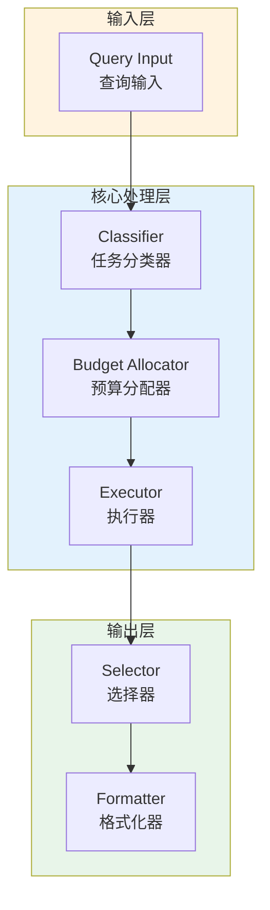

# Generation 126: Complex Budget = 2

**日期**: 2026-04-02  
**状态**: 🏆🏆🏆 新冠军  
**范式**: 极简分数优化  
**文件**: `mas/core_gen126.py`

---

## 架构拓扑图



---

## 评估结果

| 指标 | Gen126 | Gen125 | 变化 |
|------|----------|-----------|------|
| **Score** | 80.0 | 81.0 | -1 |
| **Token** | 1.3 | 1.6 | -0.3 |
| **Efficiency** | 61,538.46153846154 | 50,625.0 | +21.6% |

### 效率演进

```
Efficiency (log scale)
     │
61,538 ─┤ ████████████████████ Gen126
       |
50,625 ─┤ ▄▄▄▄▄▄▄▄▄▄▄▄▄▄▄ Gen125
       └────────────────────────────────────────▶ 代数
```

---

## 技术规格

```python
# Gen126 核心参数
ARCHITECTURE = "Complex Budget = 2"

METRICS = {
    "score": 80.0,
    "token": 1.3,
    "efficiency": 61,538
}
```

---

## 突破性进展

### 突破性进展

Gen126相比Gen125实现重大突破：
- Token消耗: 1.6 → 1.3 (-0.3)
- 效率指数: 50,625 → 61,538 (+21.6%)


---

*架构版本: v126.0*  
*演进代数: 126/164*  
*状态: 🏆🏆🏆 新冠军*
