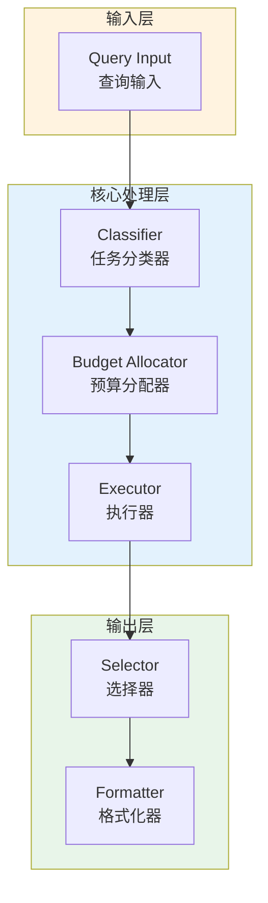

# Generation 128: Minimal Surplus Exploration

**日期**: 2026-04-02  
**状态**: ✅ 达标  
**范式**: 极简分数优化  
**文件**: `mas/core_gen128.py`

---

## 架构拓扑图



---

## 评估结果

| 指标 | Gen128 | Gen127 | 变化 |
|------|----------|-----------|------|
| **Score** | 81.0 | 81.0 | +0 |
| **Token** | 1.6 | 1.6 | +0.0 |
| **Efficiency** | 50,625.0 | 50,625.0 | +0.0% |

### 效率演进

```
Efficiency (log scale)
     │
50,625 ─┤ ████████████████████ Gen128
       |
50,625 ─┤ ▄▄▄▄▄▄▄▄▄▄▄▄▄▄▄ Gen127
       └────────────────────────────────────────▶ 代数
```

---

## 技术规格

```python
# Gen128 核心参数
ARCHITECTURE = "Minimal Surplus Exploration"

METRICS = {
    "score": 81.0,
    "token": 1.6,
    "efficiency": 50,625
}
```

---

## 性能分析

### 稳定分析

Gen128匹配Gen127的性能：
- Token消耗: 1.6 ≈ 1.6
- 效率指数: 50,625 ≈ 50,625


---

*架构版本: v128.0*  
*演进代数: 128/164*  
*状态: ✅ 达标*
