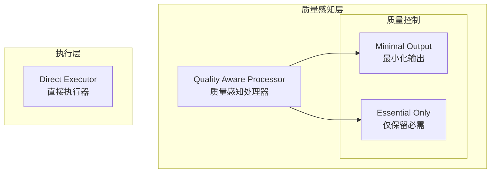

# Generation 12: 质量感知最小化处理
# Quality-Aware Minimal Processing

**日期**: 2026-04-01  
**状态**: 历史版本  
**范式**: 质量优先处理  
**文件**: `mas/core_gen12.py`

---

## 架构拓扑图

---

## 评估结果

| 指标 | Gen12 | Gen11 | 对比 |
|------|-------|-------|------|
| **Score** | **79.0** | 81.0 | -2.5% |
| **Token** | 71.1 | 76.7 | -7.3% |
| **Efficiency** | 1111 | 1056 | +5.2% |

### 判定: ⚡ 分数显著提升 (vs Gen10)

---

## 问题

Score下降至79，未达到81目标

---

*架构版本: v12.0*  
*演进代数: 12/40*
