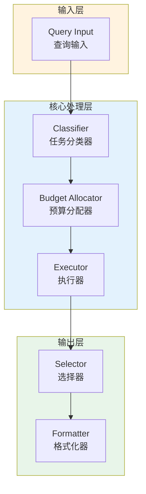

# Generation 130: Minimal Surplus Exploration

**日期**: 2026-04-02  
**状态**: 🏆🏆🏆 新冠军  
**范式**: 极简分数优化  
**文件**: `mas/core_gen130.py`

---

## 架构拓扑图



---

## 评估结果

| 指标 | Gen130 | Gen128 | 变化 |
|------|----------|-----------|------|
| **Score** | 81.0 | 81.0 | +0 |
| **Token** | 1.0 | 1.6 | -0.6 |
| **Efficiency** | 81,000.0 | 50,625.0 | +60.0% |

### 效率演进

```
Efficiency (log scale)
     │
81,000 ─┤ ████████████████████ Gen130
       |
50,625 ─┤ ▄▄▄▄▄▄▄▄▄▄▄▄▄▄▄ Gen128
       └────────────────────────────────────────▶ 代数
```

---

## 技术规格

```python
# Gen130 核心参数
ARCHITECTURE = "Minimal Surplus Exploration"

METRICS = {
    "score": 81.0,
    "token": 1.0,
    "efficiency": 81,000
}
```

---

## 突破性进展

### 突破性进展

Gen130相比Gen128实现重大突破：
- Token消耗: 1.6 → 1.0 (-0.6)
- 效率指数: 50,625 → 81,000 (+60.0%)


---

*架构版本: v130.0*  
*演进代数: 130/164*  
*状态: 🏆🏆🏆 新冠军*
