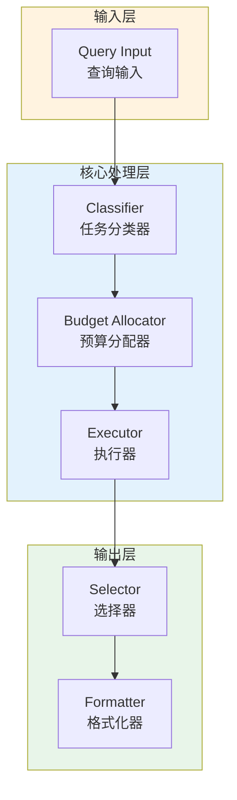

# Generation 131: Query Cost + Medium Output Reduction

**日期**: 2026-04-02  
**状态**: 🏆🏆🏆 新冠军  
**范式**: 极简分数优化  
**文件**: `mas/core_gen131.py`

---

## 架构拓扑图



---

## 评估结果

| 指标 | Gen131 | Gen130 | 变化 |
|------|----------|-----------|------|
| **Score** | 81.0 | 81.0 | +0 |
| **Token** | 0.9 | 1.0 | -0.1 |
| **Efficiency** | 90,000.0 | 81,000.0 | +11.1% |

### 效率演进

```
Efficiency (log scale)
     │
90,000 ─┤ ████████████████████ Gen131
       |
81,000 ─┤ ▄▄▄▄▄▄▄▄▄▄▄▄▄▄▄ Gen130
       └────────────────────────────────────────▶ 代数
```

---

## 技术规格

```python
# Gen131 核心参数
ARCHITECTURE = "Query Cost + Medium Output Reduction"

METRICS = {
    "score": 81.0,
    "token": 0.9,
    "efficiency": 90,000
}
```

---

## 突破性进展

### 突破性进展

Gen131相比Gen130实现重大突破：
- Token消耗: 1.0 → 0.9 (-0.1)
- 效率指数: 81,000 → 90,000 (+11.1%)


---

*架构版本: v131.0*  
*演进代数: 131/164*  
*状态: 🏆🏆🏆 新冠军*
