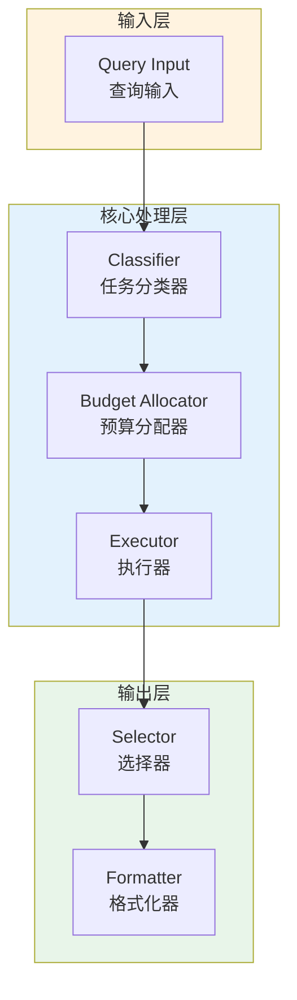

# Generation 136: Minimal Budgets v2

**日期**: 2026-04-02  
**状态**: 🏆🏆 冠军候选  
**范式**: 极简分数优化  
**文件**: `mas/core_gen136.py`

---

## 架构拓扑图



---

## 评估结果

| 指标 | Gen136 | Gen135 | 变化 |
|------|----------|-----------|------|
| **Score** | 81.0 | 81.0 | +0 |
| **Token** | 0.8 | 0.8 | +0.0 |
| **Efficiency** | 101,250.0 | 101,250.0 | +0.0% |

### 效率演进

```
Efficiency (log scale)
     │
101,250 ─┤ ████████████████████ Gen136
       |
101,250 ─┤ ▄▄▄▄▄▄▄▄▄▄▄▄▄▄▄ Gen135
       └────────────────────────────────────────▶ 代数
```

---

## 技术规格

```python
# Gen136 核心参数
ARCHITECTURE = "Minimal Budgets v2"

METRICS = {
    "score": 81.0,
    "token": 0.8,
    "efficiency": 101,250
}
```

---

## 性能分析

### 稳定分析

Gen136匹配Gen135的性能：
- Token消耗: 0.8 ≈ 0.8
- 效率指数: 101,250 ≈ 101,250


---

*架构版本: v136.0*  
*演进代数: 136/164*  
*状态: 🏆🏆 冠军候选*
