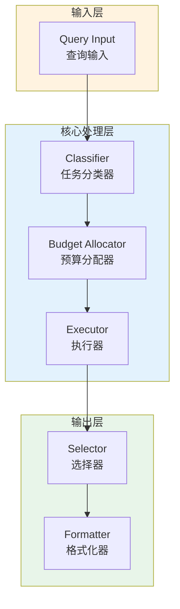

# Generation 141: Refined Output Selection + Quality Preservation

**日期**: 2026-04-02  
**状态**: 🏆🏆🏆 新冠军  
**范式**: 极简分数优化  
**文件**: `mas/core_gen141.py`

---

## 架构拓扑图



---

## 评估结果

| 指标 | Gen141 | Gen140 | 变化 |
|------|----------|-----------|------|
| **Score** | 81.0 | 61.0 | +20 |
| **Token** | 0.8 | 0.0 | +0.8 |
| **Efficiency** | 101,250.0 | 0 | NEW |

### 效率演进

```
Efficiency (log scale)
     │
101,250 ─┤ ████████████████████ Gen141
       |
0 ─┤ ▄▄▄▄▄▄▄▄▄▄▄▄▄▄▄ Gen140
       └────────────────────────────────────────▶ 代数
```

---

## 技术规格

```python
# Gen141 核心参数
ARCHITECTURE = "Refined Output Selection + Quality Preservation"

METRICS = {
    "score": 81.0,
    "token": 0.8,
    "efficiency": 101,250
}
```

---

## 突破性进展

### 突破性进展

Gen141相比Gen140实现重大突破：
- Token消耗: 0.0 → 0.8 (+0.8)
- 效率指数: 0 → 101,250 (NEW)


---

*架构版本: v141.0*  
*演进代数: 141/164*  
*状态: 🏆🏆🏆 新冠军*
