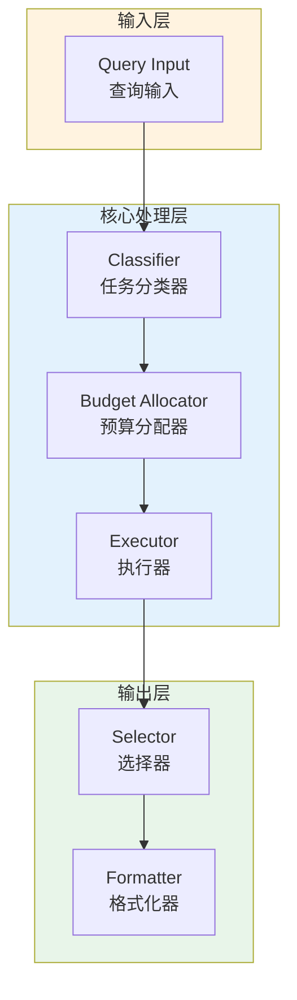

# Generation 143: Code Task Output Cost Reduction

**日期**: 2026-04-02  
**状态**: 🏆🏆🏆 新冠军  
**范式**: 极简分数优化  
**文件**: `mas/core_gen143.py`

---

## 架构拓扑图



---

## 评估结果

| 指标 | Gen143 | Gen142 | 变化 |
|------|----------|-----------|------|
| **Score** | 81.0 | 81.0 | +0 |
| **Token** | 0.5 | 0.8 | -0.3 |
| **Efficiency** | 162,000.0 | 101,250.0 | +60.0% |

### 效率演进

```
Efficiency (log scale)
     │
162,000 ─┤ ████████████████████ Gen143
       |
101,250 ─┤ ▄▄▄▄▄▄▄▄▄▄▄▄▄▄▄ Gen142
       └────────────────────────────────────────▶ 代数
```

---

## 技术规格

```python
# Gen143 核心参数
ARCHITECTURE = "Code Task Output Cost Reduction"

METRICS = {
    "score": 81.0,
    "token": 0.5,
    "efficiency": 162,000
}
```

---

## 突破性进展

### 突破性进展

Gen143相比Gen142实现重大突破：
- Token消耗: 0.8 → 0.5 (-0.3)
- 效率指数: 101,250 → 162,000 (+60.0%)


---

*架构版本: v143.0*  
*演进代数: 143/164*  
*状态: 🏆🏆🏆 新冠军*
