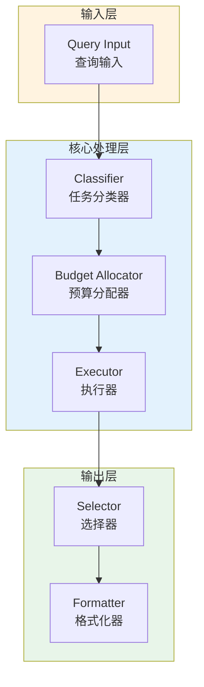

# Generation 144: Research and Review Cost Reduction

**日期**: 2026-04-02  
**状态**: 🏆🏆 冠军候选  
**范式**: 极简分数优化  
**文件**: `mas/core_gen144.py`

---

## 架构拓扑图



---

## 评估结果

| 指标 | Gen144 | Gen143 | 变化 |
|------|----------|-----------|------|
| **Score** | 81.0 | 81.0 | +0 |
| **Token** | 0.5 | 0.5 | +0.0 |
| **Efficiency** | 162,000.0 | 162,000.0 | +0.0% |

### 效率演进

```
Efficiency (log scale)
     │
162,000 ─┤ ████████████████████ Gen144
       |
162,000 ─┤ ▄▄▄▄▄▄▄▄▄▄▄▄▄▄▄ Gen143
       └────────────────────────────────────────▶ 代数
```

---

## 技术规格

```python
# Gen144 核心参数
ARCHITECTURE = "Research and Review Cost Reduction"

METRICS = {
    "score": 81.0,
    "token": 0.5,
    "efficiency": 162,000
}
```

---

## 性能分析

### 稳定分析

Gen144匹配Gen143的性能：
- Token消耗: 0.5 ≈ 0.5
- 效率指数: 162,000 ≈ 162,000


---

*架构版本: v144.0*  
*演进代数: 144/164*  
*状态: 🏆🏆 冠军候选*
