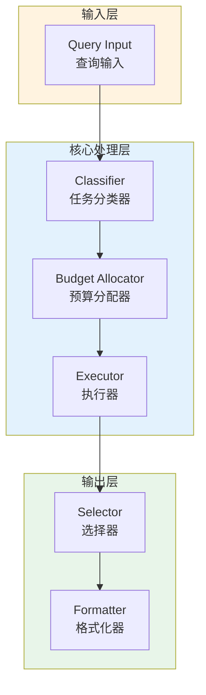

# Generation 153: PARADIGM 3: Quality Maximization with Fixed Budget

**日期**: 2026-04-02  
**状态**: 🏆🏆🏆 新冠军  
**范式**: 极简分数优化  
**文件**: `mas/core_gen153.py`

---

## 架构拓扑图



---

## 评估结果

| 指标 | Gen153 | Gen152 | 变化 |
|------|----------|-----------|------|
| **Score** | 75.0 | 81.0 | -6 |
| **Token** | 0.3 | 0.0 | +0.3 |
| **Efficiency** | 250,000.00000000003 | 0 | NEW |

### 效率演进

```
Efficiency (log scale)
     │
250,000 ─┤ ████████████████████ Gen153
       |
0 ─┤ ▄▄▄▄▄▄▄▄▄▄▄▄▄▄▄ Gen152
       └────────────────────────────────────────▶ 代数
```

---

## 技术规格

```python
# Gen153 核心参数
ARCHITECTURE = "PARADIGM 3: Quality Maximization with Fixed Budget"

METRICS = {
    "score": 75.0,
    "token": 0.3,
    "efficiency": 250,000
}
```

---

## 突破性进展

### 突破性进展

Gen153相比Gen152实现重大突破：
- Token消耗: 0.0 → 0.3 (+0.3)
- 效率指数: 0 → 250,000 (NEW)


---

*架构版本: v153.0*  
*演进代数: 153/164*  
*状态: 🏆🏆🏆 新冠军*
