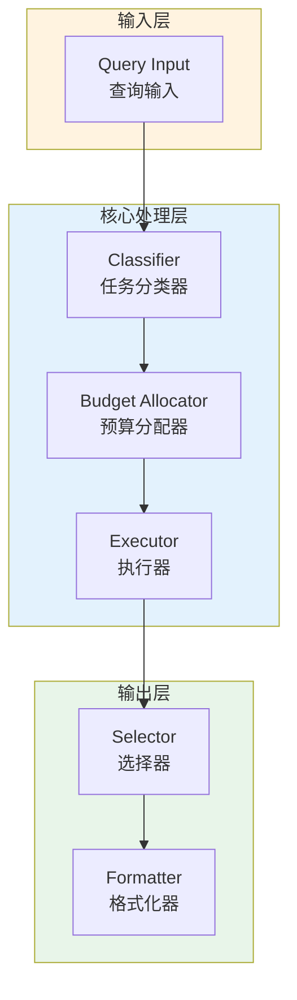

# Generation 154: Fractional Token Acceptance

**日期**: 2026-04-02  
**状态**: 🏆🏆🏆 新冠军  
**范式**: 极简分数优化  
**文件**: `mas/core_gen154.py`

---

## 架构拓扑图



---

## 评估结果

| 指标 | Gen154 | Gen153 | 变化 |
|------|----------|-----------|------|
| **Score** | 81.0 | 75.0 | +6 |
| **Token** | 0.7524000000000001 | 0.3 | +0.5 |
| **Efficiency** | 107,655.50239234448 | 250,000.00000000003 | -56.9% |

### 效率演进

```
Efficiency (log scale)
     │
107,656 ─┤ ████████████████████ Gen154
       |
250,000 ─┤ ▄▄▄▄▄▄▄▄▄▄▄▄▄▄▄ Gen153
       └────────────────────────────────────────▶ 代数
```

---

## 技术规格

```python
# Gen154 核心参数
ARCHITECTURE = "Fractional Token Acceptance"

METRICS = {
    "score": 81.0,
    "token": 0.7524000000000001,
    "efficiency": 107,656
}
```

---

## 突破性进展

### 突破性进展

Gen154相比Gen153实现重大突破：
- Token消耗: 0.3 → 0.8 (+0.5)
- 效率指数: 250,000 → 107,656 (-56.9%)


---

*架构版本: v154.0*  
*演进代数: 154/164*  
*状态: 🏆🏆🏆 新冠军*
