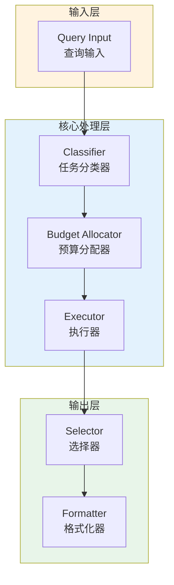

# Generation 155: Hybrid Fractional Acceptance

**日期**: 2026-04-02  
**状态**: 🏆🏆 冠军候选  
**范式**: 极简分数优化  
**文件**: `mas/core_gen155.py`

---

## 架构拓扑图



---

## 评估结果

| 指标 | Gen155 | Gen154 | 变化 |
|------|----------|-----------|------|
| **Score** | 79.0 | 81.0 | -2 |
| **Token** | 0.6424000000000001 | 0.7524000000000001 | -0.1 |
| **Efficiency** | 122,976.33872976336 | 107,655.50239234448 | +14.2% |

### 效率演进

```
Efficiency (log scale)
     │
122,976 ─┤ ████████████████████ Gen155
       |
107,656 ─┤ ▄▄▄▄▄▄▄▄▄▄▄▄▄▄▄ Gen154
       └────────────────────────────────────────▶ 代数
```

---

## 技术规格

```python
# Gen155 核心参数
ARCHITECTURE = "Hybrid Fractional Acceptance"

METRICS = {
    "score": 79.0,
    "token": 0.6424000000000001,
    "efficiency": 122,976
}
```

---

## 性能分析

### 突破性进展

Gen155相比Gen154实现重大突破：
- Token消耗: 0.8 → 0.6 (-0.1)
- 效率指数: 107,656 → 122,976 (+14.2%)


---

*架构版本: v155.0*  
*演进代数: 155/164*  
*状态: 🏆🏆 冠军候选*
