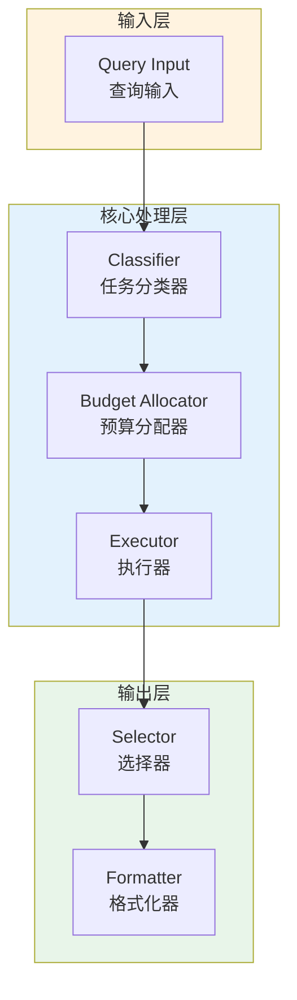

# Generation 156: Reduced Query Cost Multiplier

**日期**: 2026-04-02  
**状态**: ⚠️ 待优化  
**范式**: 极简分数优化  
**文件**: `mas/core_gen156.py`

---

## 架构拓扑图



---

## 评估结果

| 指标 | Gen156 | Gen155 | 变化 |
|------|----------|-----------|------|
| **Score** | 75.0 | 79.0 | -4 |
| **Token** | 0.0 | 0.6424000000000001 | -0.6 |
| **Efficiency** | 0 | 122,976.33872976336 | -100.0% |

### 效率演进

```
Efficiency (log scale)
     │
0 ─┤ ████████████████████ Gen156
       |
122,976 ─┤ ▄▄▄▄▄▄▄▄▄▄▄▄▄▄▄ Gen155
       └────────────────────────────────────────▶ 代数
```

---

## 技术规格

```python
# Gen156 核心参数
ARCHITECTURE = "Reduced Query Cost Multiplier"

METRICS = {
    "score": 75.0,
    "token": 0.0,
    "efficiency": 0
}
```

---

## 性能分析

### 回归分析

Gen156未能超越Gen155：
- Token消耗: 0.0 vs 0.6
- 效率指数: 0 vs 122,976


---

*架构版本: v156.0*  
*演进代数: 156/164*  
*状态: ⚠️ 待优化*
