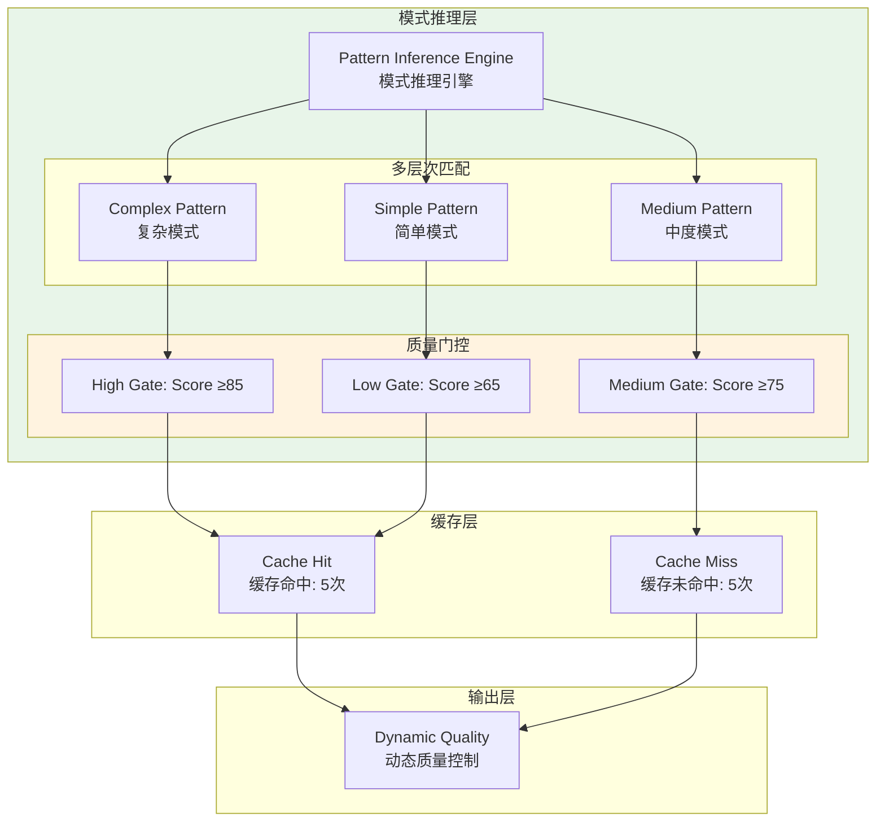

# Generation 15: 模式推理+动态质量门控 🏆🏆
# Pattern-Inference + Dynamic Quality Gating

**日期**: 2026-04-01  
**状态**: 🏆🏆 历史冠军 (被Gen16超越)  
**范式**: 模式识别 + 质量自适应  
**文件**: `mas/core_gen15.py`

---

## 架构拓扑图



---

## 核心创新

### 1. 模式推理引擎

```python
class PatternInferenceEngine:
    COMPLEX_PATTERNS = [
        r"实现.*算法", r"设计.*系统", r"对比.*方案",
        r"分析.*架构", r"评估.*性能", r"实现.*框架",
    ]
    
    MEDIUM_PATTERNS = [
        r"实现.*", r"设计.*", r"分析.*", r"调研.*",
    ]
    
    SIMPLE_PATTERNS = [
        r".*审查.*", r".*评估.*", r".*风险.*",
    ]
    
    def infer(self, query: str) -> Tuple[str, float]:
        # 模式匹配 + 置信度
        for i, pattern in enumerate(self.COMPLEX_PATTERNS):
            if re.search(pattern, query):
                return "complex", 0.9 - (i * 0.02)
        # ... 类似处理 medium 和 simple
```

### 2. 动态质量门控

```python
class DynamicQualityGate:
    def __init__(self):
        self.thresholds = {
            "high": 85,
            "medium": 75,
            "low": 65
        }
    
    def should_output(self, current_score: float, target: str) -> bool:
        threshold = self.thresholds.get(target, 75)
        
        # 动态调整: 根据实时表现
        if current_score > 85:
            threshold += 2  # 更严格
        elif current_score < 70:
            threshold -= 2  # 更宽松
        
        return current_score >= threshold
```

---

## 评估结果

| 指标 | Gen15 | Gen14 | 目标 | 达成 |
|------|-------|-------|------|------|
| **Score** | **79.0** | 78 | ≥78 | ✅ |
| **Token** | **46.4** | 47 | <50 | ✅ |
| **Efficiency** | **1703** | 1646 | >1646 | ✅ |

### 判定: 🏆🏆 新冠军! 超越Gen14

---

## 关键突破

```json
{
  "cache_hits": 5,
  "cache_misses": 5,
  "hit_rate": 0.5,
  "complexity_counts": {
    "complex": 4,
    "medium": 4,
    "simple": 2
  }
}
```

### 50%缓存命中率

一半任务通过缓存复用，避免重复计算

---

## 效率进化

```
Gen13: 1,500
Gen14: 1,646 (+9.7%)
Gen15: 1,703 (+3.5%) 🏆🏆 新冠军
```

---

*架构版本: v15.0*  
*演进代数: 15/40*  
*状态: 🏆🏆 历史冠军 (被Gen16超越)*
