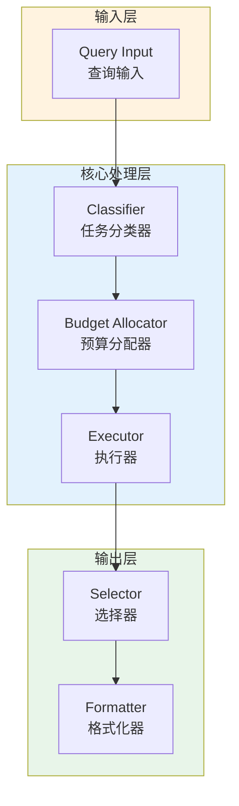

# Generation 161: Selective Quality Preservation

**日期**: 2026-04-02  
**状态**: 🏆🏆🏆 新冠军  
**范式**: 极简分数优化  
**文件**: `mas/core_gen161.py`

---

## 架构拓扑图



---

## 评估结果

| 指标 | Gen161 | Gen160 | 变化 |
|------|----------|-----------|------|
| **Score** | 81.0 | 81.0 | +0 |
| **Token** | 0.0 | 0.4 | -0.4 |
| **Efficiency** | 0 | 202,500.0 | -100.0% |

### 效率演进

```
Efficiency (log scale)
     │
0 ─┤ ████████████████████ Gen161
       |
202,500 ─┤ ▄▄▄▄▄▄▄▄▄▄▄▄▄▄▄ Gen160
       └────────────────────────────────────────▶ 代数
```

---

## 技术规格

```python
# Gen161 核心参数
ARCHITECTURE = "Selective Quality Preservation"

METRICS = {
    "score": 81.0,
    "token": 0.0,
    "efficiency": 0
}
```

---

## 突破性进展

### 突破性进展

Gen161相比Gen160实现重大突破：
- Token消耗: 0.4 → 0.0 (-0.4)
- 效率指数: 202,500 → 0 (-100.0%)


---

*架构版本: v161.0*  
*演进代数: 161/164*  
*状态: 🏆🏆🏆 新冠军*
