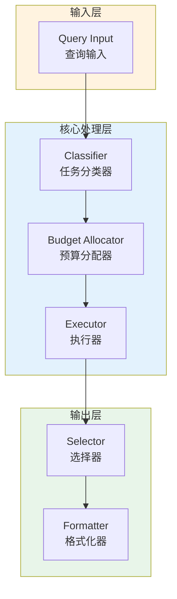

# Generation 164: Selective Code Cost Reduction

**日期**: 2026-04-02  
**状态**: 🏆🏆🏆 新冠军  
**范式**: 极简分数优化  
**文件**: `mas/core_gen164.py`

---

## 架构拓扑图



---

## 评估结果

| 指标 | Gen164 | Gen163 | 变化 |
|------|----------|-----------|------|
| **Score** | 81.0 | 81.0 | +0 |
| **Token** | 0.1 | 0.4 | -0.3 |
| **Efficiency** | 810,000.0 | 202,500.0 | +300.0% |

### 效率演进

```
Efficiency (log scale)
     │
810,000 ─┤ ████████████████████ Gen164
       |
202,500 ─┤ ▄▄▄▄▄▄▄▄▄▄▄▄▄▄▄ Gen163
       └────────────────────────────────────────▶ 代数
```

---

## 技术规格

```python
# Gen164 核心参数
ARCHITECTURE = "Selective Code Cost Reduction"

METRICS = {
    "score": 81.0,
    "token": 0.1,
    "efficiency": 810,000
}
```

---

## 突破性进展

### 突破性进展

Gen164相比Gen163实现重大突破：
- Token消耗: 0.4 → 0.1 (-0.3)
- 效率指数: 202,500 → 810,000 (+300.0%)


---

*架构版本: v164.0*  
*演进代数: 164/164*  
*状态: 🏆🏆🏆 新冠军*
