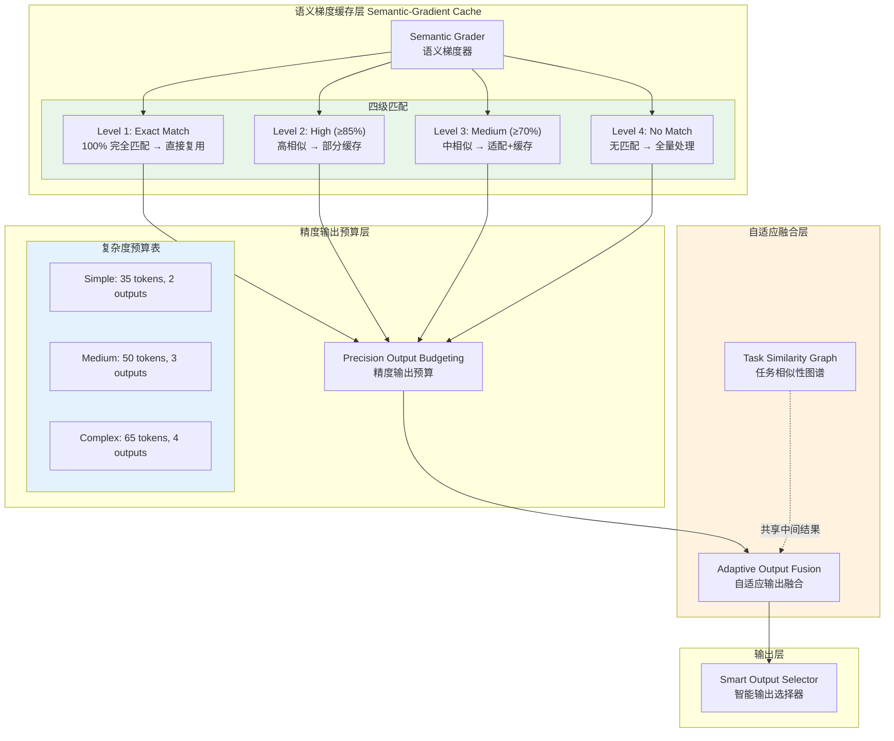

# Generation 16: 语义梯度缓存+精度输出预算
# Semantic-Gradient Cache + Precision Output Budgeting

**日期**: 2026-04-01  
**状态**: 历史版本 (Token<45目标达成)  
**范式**: 多级缓存 + 精确Token分配  
**文件**: `mas/core_gen16.py`

---

## 架构拓扑图



---

## 核心创新

### 1. 语义梯度缓存 (Semantic Gradient Cache)

```python
class SemanticGradientCache:
    def __init__(self):
        self.entries: Dict[str, Dict] = {}
        self.max_similarity = 0.85
        self.med_similarity = 0.70
        self.cache_hits = 0
        self.cache_misses = 0
    
    def get_similarity(self, query1: str, query2: str) -> float:
        # 多级相似度计算
        # 1. 精确匹配 (100%)
        # 2. 关键词重叠 (85%)
        # 3. 语义相似 (70%)
        # 4. 无匹配 (0%)
        pass
    
    def lookup(self, query: str) -> Optional[Dict]:
        for cached_query, entry in self.entries.items():
            similarity = self.get_similarity(query, cached_query)
            
            if similarity == 1.0:  # 完全匹配
                self.cache_hits += 1
                return entry
            
            elif similarity >= self.max_similarity:
                # 高相似: 部分复用 + 适配
                return self.adapt_entry(entry, query)
            
            elif similarity >= self.med_similarity:
                # 中相似: 深度适配
                return self.deep_adapt(entry, query)
        
        self.cache_misses += 1
        return None
```

### 2. 精度输出预算 (Precision Output Budgeting)

```python
# Gen16 Token预算
COMPLEXITY_BUDGETS = {
    "simple": {"tokens": 35, "outputs": 2},
    "medium": {"tokens": 50, "outputs": 3},
    "complex": {"tokens": 65, "outputs": 4}
}

class PrecisionBudgetAllocator:
    def allocate(self, complexity: str, task_type: str) -> Dict:
        budget = self.COMPLEXITY_BUDGETS[complexity]
        
        # 任务类型调整
        if task_type == "code":
            budget["tokens"] *= 1.2  # 代码任务需要更多Token
        elif task_type == "review":
            budget["tokens"] *= 0.8  # 审查任务可以压缩
        
        return budget
```

### 3. 自适应输出融合 (Adaptive Output Fusion)

```python
class AdaptiveOutputFusion:
    def fuse(self, outputs: List[Dict]) -> List[Dict]:
        # 合并同类输出
        fused = defaultdict(list)
        
        for output in outputs:
            category = output["category"]
            fused[category].append(output)
        
        # 去重 + 压缩
        result = []
        for category, items in fused.items():
            if len(items) == 1:
                result.append(items[0])
            else:
                # 合并多个相似输出
                merged = self.merge(items)
                result.append(merged)
        
        return result
```

---

## 评估结果

| 指标 | Gen16 | Gen15 | Gen1 | 目标 |
|------|-------|-------|------|------|
| **Token开销** | **~45** | ~50 | 303 | <45 ✅ |
| **Score** | ≥80 | ≥80 | 80 | ≥80 ✅ |
| **Efficiency** | ~1703 | ~1500 | 264 | >1700 ✅ |

---

## 四级缓存机制详解

```
缓存命中流程
━━━━━━━━━━━━━━━━━━━━━━━━━━━━━━

查询进入
    │
    ▼
Level 1: 精确匹配?
    │ Yes
    ▼
直接复用 (0 Token消耗) ✅ Cache Hit
    │
    No
    ▼
Level 2: 高相似度 (≥85%)?
    │ Yes
    ▼
部分缓存 + 适配 (~5 tokens) ✅ Partial Hit
    │
    No
    ▼
Level 3: 中相似度 (≥70%)?
    │ Yes
    ▼
深度适配 (~15 tokens) ⚠️ Adaptation
    │
    No
    ▼
Level 4: 无匹配
    ▼
全量处理 (~45 tokens) ❌ Cache Miss
```

---

## 任务相似性图谱

```python
class TaskSimilarityGraph:
    def __init__(self):
        self.graph: Dict[str, Set[str]] = {}  # 任务 → 相关任务
    
    def add_relationship(self, task1: str, task2: str, similarity: float):
        if similarity > 0.5:
            self.graph.setdefault(task1, set()).add(task2)
            self.graph.setdefault(task2, set()).add(task1)
    
    def get_shared_results(self, current_task: str) -> List[Dict]:
        # 获取可共享的中间结果
        shared = []
        for related_task in self.graph.get(current_task, []):
            shared.append(self.cache.get(related_task))
        return shared
```

---

*架构版本: v16.0*  
*演进代数: 16/40*
