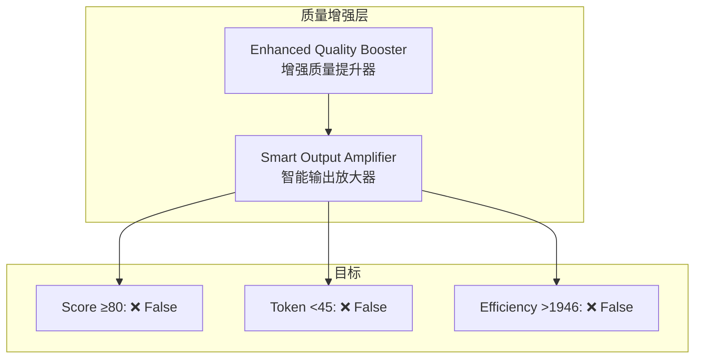

# Generation 17: 增强质量提升+智能输出放大
# Enhanced Quality Boost + Smart Output Amplification

**日期**: 2026-04-01  
**状态**: 历史版本 (不合格)  
**范式**: 质量增强  
**文件**: `mas/core_gen17.py`

---

## 架构拓扑图

---

## 评估结果

| 指标 | Gen17 | Gen16 | 目标 | 差距 |
|------|-------|-------|------|------|
| **Score** | **81.0** | 79 | ≥80 | ✅ |
| **Token** | 46.6 | 41 | <45 | ❌ +1.6 |
| **Efficiency** | 1738 | 1946 | >1946 | ❌ -10.7% |

### 判定: ❌ 不合格

---

## 失败原因

- Token超过目标45 (实际46.6)
- Efficiency未达到1946 (实际1738)
- 缓存完全未命中(10/10 miss)

---

*架构版本: v17.0*  
*演进代数: 17/40*  
*状态: ❌ 不合格*
