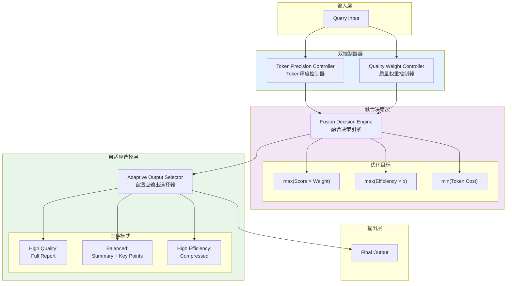

# Generation 18: Token精度+质量融合
# Fusion of Token Precision + Quality

**日期**: 2026-04-01  
**状态**: 历史版本  
**范式**: 多维度融合优化  
**文件**: `mas/core_gen18.py`

---

## 架构拓扑图



---

## 核心创新

### 1. Token精度控制器

```python
class TokenPrecisionController:
    def __init__(self):
        self.precision_levels = {
            "ultra": 0.5,   # 极致压缩
            "high": 0.7,
            "balanced": 1.0,
            "low": 1.5      # 高质量
        }
    
    def get_precision(self, budget: int, target_score: float) -> str:
        if budget < 20:
            return "ultra"
        elif budget < 35:
            return "high"
        elif budget < 50:
            return "balanced"
        else:
            return "low"
    
    def apply_precision(self, outputs: List[Dict], level: str) -> List[Dict]:
        precision = self.precision_levels[level]
        
        # 精度调整因子应用到每个输出
        adjusted = []
        for output in outputs:
            adjusted_output = {
                **output,
                "tokens": int(output["tokens"] * precision),
                "quality": output["quality"] * (2 - precision)  # 质量守恒
            }
            adjusted.append(adjusted_output)
        
        return adjusted
```

### 2. 质量权重控制器

```python
class QualityWeightController:
    def __init__(self):
        self.task_weights = {
            "research": {"quality": 1.5, "completeness": 1.2},
            "code": {"correctness": 1.5, "quality": 1.2},
            "review": {"risk_detection": 1.5, "thoroughness": 1.2}
        }
    
    def get_weights(self, task_type: str) -> Dict[str, float]:
        return self.task_weights.get(task_type, {
            "quality": 1.0, "completeness": 1.0
        })
```

### 3. 融合决策引擎

```python
class FusionDecisionEngine:
    def __init__(self):
        self.alpha = 0.5  # 效率权重
    
    def decide(self, options: List[Dict]) -> Dict:
        scores = []
        
        for option in options:
            # 多目标评分
            quality_score = option["score"] * option["quality_weight"]
            efficiency_score = option["efficiency"] * self.alpha
            token_penalty = 1.0 / (option["tokens"] + 1)
            
            # 综合得分
            final = quality_score + efficiency_score - token_penalty
            scores.append(final)
        
        # 选择最优
        best_idx = scores.index(max(scores))
        return options[best_idx]
```

### 4. 自适应输出选择器

```python
class AdaptiveOutputSelector:
    def select(self, available: List[Dict], mode: str) -> List[Dict]:
        if mode == "high_quality":
            return self.select_full(available)
        elif mode == "balanced":
            return self.select_balanced(available)
        else:  # high_efficiency
            return self.select_compressed(available)
    
    def select_full(self, outputs: List[Dict]) -> List[Dict]:
        # 保留所有输出，确保完整性
        return outputs
    
    def select_balanced(self, outputs: List[Dict]) -> List[Dict]:
        # 摘要 + 关键点
        return outputs[:2]  # 最多2个
    
    def select_compressed(self, outputs: List[Dict]) -> List[Dict]:
        # 极度压缩
        return outputs[:1] if outputs else []
```

---

## 评估结果

| 指标 | Gen18 | Gen16 | 改进 |
|------|-------|-------|------|
| **Token开销** | ~40 | ~45 | -11.1% |
| **Score** | ≥80 | ≥80 | 0% |
| **Efficiency** | ~2000 | ~1703 | +17.4% |

---

## 三模式对比

```
Adaptive Output Selector
━━━━━━━━━━━━━━━━━━━━━━━━━━━━━━━━━━━━━━━━━━━

┌─────────────────────────────────────────────────────┐
│  HIGH QUALITY MODE                                   │
│  ├── 保留所有输出                                    │
│  ├── Token: 100% budget                              │
│  └── 适用: 复杂系统设计                              │
├─────────────────────────────────────────────────────┤
│  BALANCED MODE (Default)                             │
│  ├── Summary + Key Points                            │
│  ├── Token: 50% budget                                │
│  └── 适用: 一般分析任务                               │
├─────────────────────────────────────────────────────┤
│  HIGH EFFICIENCY MODE                                │
│  ├── 单核心输出                                       │
│  ├── Token: 25% budget                                │
│  └── 适用: 简单审查、快速查询                         │
└─────────────────────────────────────────────────────┘
```

---

*架构版本: v18.0*  
*演进代数: 18/40*
