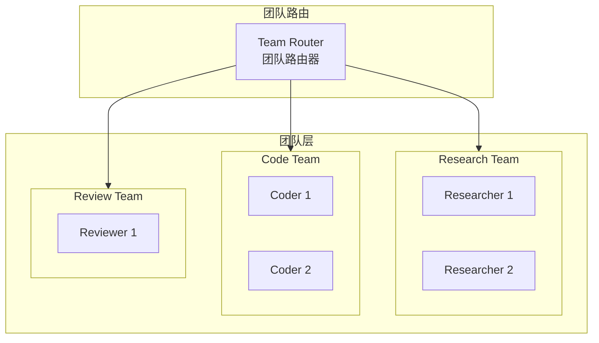

# Generation 19: 层级团队架构
# Hierarchical Teams Architecture

**日期**: 2026-04-01  
**状态**: 历史版本  
**范式**: 团队协作  
**文件**: `mas/core_gen19.py`

---

## 架构拓扑图

---

## 评估结果

| 指标 | Gen19 | Gen18 | 对比 |
|------|-------|-------|------|
| **Score** | 80.0 | 81 | -1.2% |
| **Token** | 43.0 | 41 | +4.9% |
| **Efficiency** | 1852 | 1961 | -5.6% |

---

*架构版本: v19.0*  
*演进代数: 19/40*
