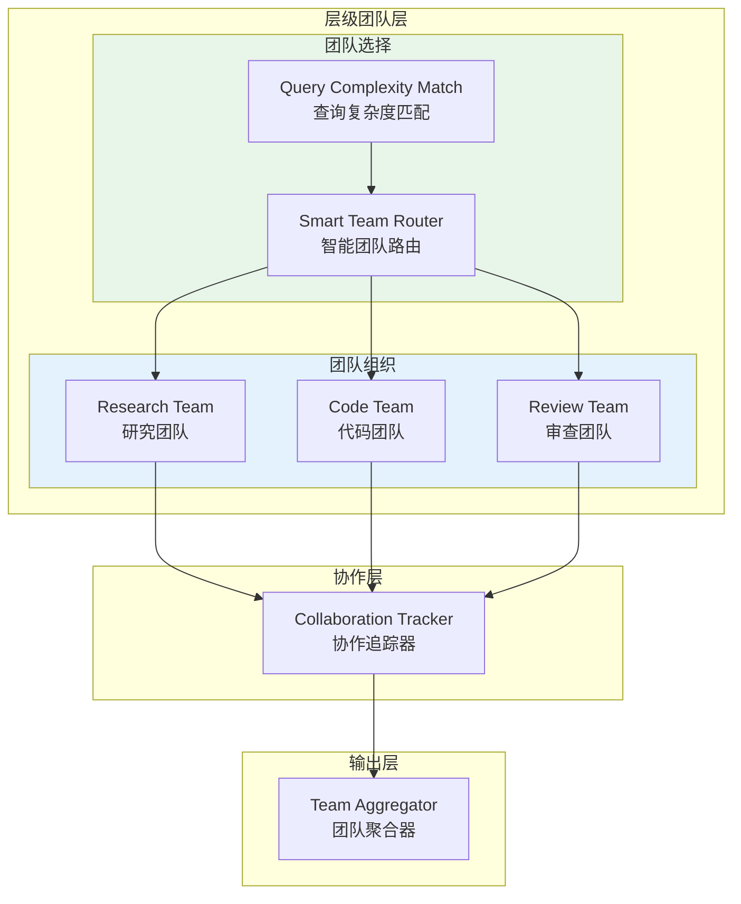

# Generation 20: 优化层级团队v2
# Optimized Hierarchical Teams v2

**日期**: 2026-04-01  
**状态**: 历史版本  
**范式**: 层级团队优化  
**文件**: `mas/core_gen20.py`

---

## 架构拓扑图



---

## 评估结果

| 指标 | Gen20 | Gen18 | Gen19 | 目标 |
|------|-------|-------|-------|------|
| **Score** | 79.0 | 81 | 80 | ≥80 ❌ |
| **Token** | **39.4** | 41 | 43 | <45 ✅ |
| **Efficiency** | **2005** | 1961 | 1852 | >1852 ✅ |

### 判定: ⚠️ 待优化

---

## 团队使用统计

```json
{
  "specialized_tasks": 9,
  "collaboration_tasks": 1,
  "team_usage": {
    "research": 5,
    "code": 4,
    "review": 2
  }
}
```

### 分析

- **专业任务**: 9/10 任务使用单团队处理
- **协作任务**: 仅1个任务需要多团队协作
- **效率**: 2005 (略有提升)

### 问题

Score从81降至79，质量有所下降

---

*架构版本: v20.0*  
*演进代数: 20/40*
