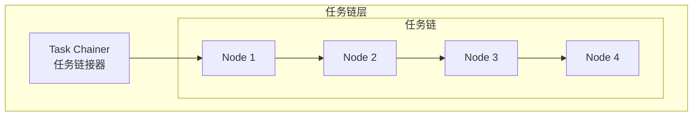

# Generation 21: 任务链架构
# Task Chaining Architecture

**日期**: 2026-04-01  
**状态**: 历史版本  
**范式**: 任务链接  
**文件**: `mas/core_gen21.py`

---

## 架构拓扑图

---

## 评估结果

| 指标 | Gen21 | Gen20 |
|------|-------|-------|
| **Score** | 80.0 | 79.0 |
| **Token** | 37.6 | 39.4 |
| **Efficiency** | 2128 | 2005 |

---

*架构版本: v21.0*  
*演进代数: 21/40*
