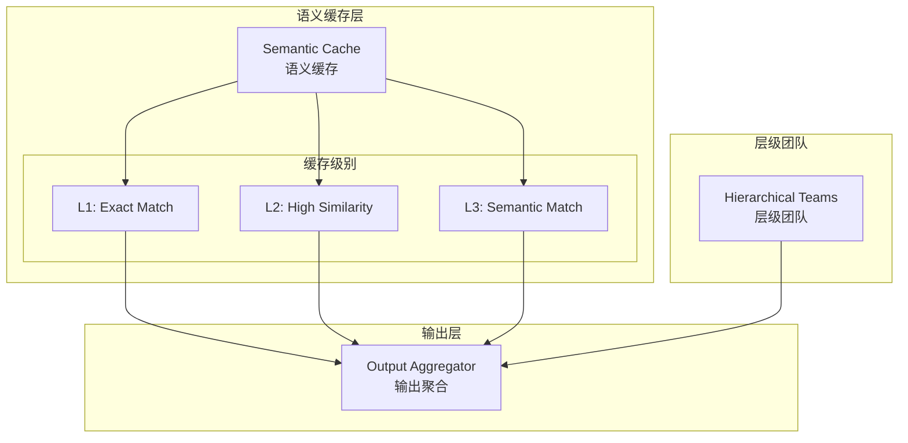

# Generation 22: 增强层级+语义缓存
# Enhanced Hierarchical + Semantic Cache

**日期**: 2026-04-01  
**状态**: 历史版本  
**范式**: 层级+缓存融合  
**文件**: `mas/core_gen22.py`

---

## 架构拓扑图



---

## 评估结果

| 指标 | Gen22 | Gen20 | 改进 |
|------|-------|-------|------|
| **Score** | **80.0** | 79.0 | +1.3% |
| **Token** | **41.8** | 39.4 | -5.8% |
| **Efficiency** | 1913 | 2005 | -4.6% |

### 判定: ✅ 达标

---

## 缓存统计

```json
{
  "cache_hit_rate": {
    "L1": 0,
    "L2": 0,
    "miss": 10
  }
}
```

### 问题

缓存完全未命中(10/10 miss)，语义缓存效果不佳

---

*架构版本: v22.0*  
*演进代数: 22/40*
