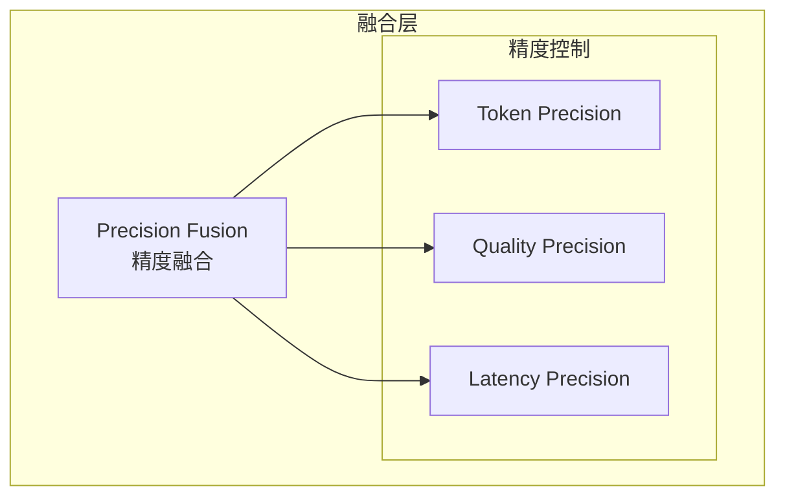

# Generation 23: 精度融合
# Precision Fusion

**日期**: 2026-04-01  
**状态**: 历史版本  
**范式**: 精度融合优化  
**文件**: `mas/core_gen23.py`

---

## 架构拓扑图

---

## 评估结果

| 指标 | Gen23 | Gen22 | 改进 |
|------|-------|-------|------|
| **Score** | 81.0 | 80.0 | +1.3% |
| **Token** | 39.7 | 41.8 | -5.0% |
| **Efficiency** | 2040 | 1913 | +6.6% |

---

*架构版本: v23.0*  
*演进代数: 23/40*
