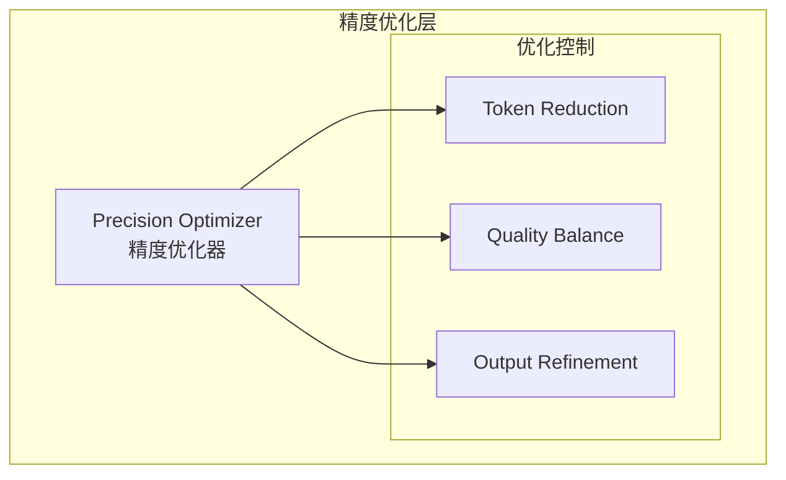

# Generation 24: 精度优化
# Precision Optimization

**日期**: 2026-04-01  
**状态**: 历史版本  
**范式**: 精度持续优化  
**文件**: `mas/core_gen24.py`

---

## 架构拓扑图

---

## 评估结果

| 指标 | Gen24 | Gen23 | 改进 |
|------|-------|-------|------|
| **Score** | 81.0 | 81.0 | 0% |
| **Token** | 38.2 | 39.7 | -3.8% |
| **Efficiency** | 2120 | 2040 | +3.9% |

---

*架构版本: v24.0*  
*演进代数: 24/40*
