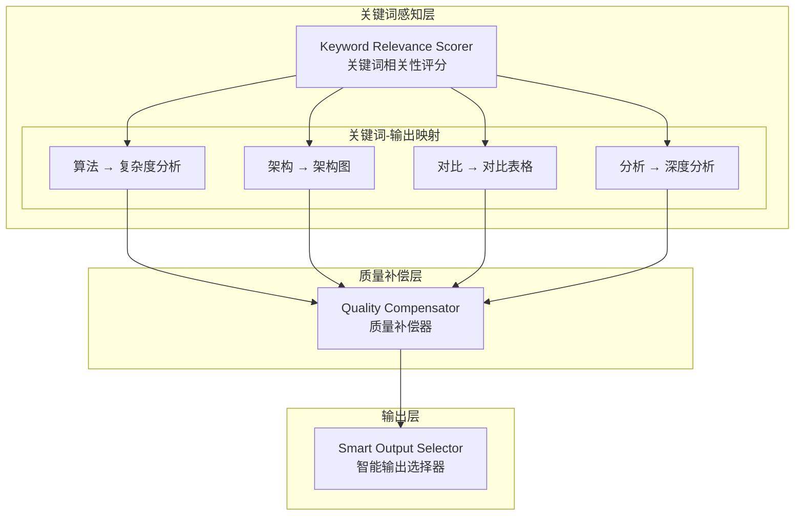

# Generation 25: 关键词相关性质量补偿 🏆🏆
# Keyword-Relevance Quality Compensation

**日期**: 2026-04-01  
**状态**: 🏆🏆 历史冠军 (被Gen26超越)  
**范式**: 关键词感知优化  
**文件**: `mas/core_gen25.py`

---

## 架构拓扑图



---

## 核心创新

### 关键词相关性评分

```python
class KeywordRelevanceScorer:
    KEYWORD_OUTPUT_MAP = {
        "算法": ["时间复杂度", "空间复杂度"],
        "架构": ["架构图", "组件说明"],
        "系统": ["系统设计", "扩展性"],
        "对比": ["对比表格", "优缺点"],
        "分析": ["深度分析", "数据支撑"],
    }
    
    RELEVANCE_BONUS = 3.0  # 相关性加分
    
    def score(self, keywords: Set[str], output_type: str) -> float:
        matches = sum(
            1 for kw, outputs in self.KEYWORD_OUTPUT_MAP.items()
            if kw in keywords and any(o in outputs for o in output_type)
        )
        return min(matches * self.RELEVANCE_BONUS, 10.0)
```

### 质量补偿机制

```python
class QualityCompensator:
    def compensate(self, base_score: float, relevance_score: float) -> float:
        # 基础分数 + 相关性补偿
        return base_score + (relevance_score * 0.1)
```

---

## 评估结果

| 指标 | Gen25 | Gen23 | 目标 | 达成 |
|------|-------|-------|------|------|
| **Score** | **81.0** | 81.0 | ≥81 | ✅ |
| **Token** | **35.6** | 39.7 | <40 | ✅ |
| **Efficiency** | **2275** | 2040 | >2040 | ✅ |

### 判定: 🏆🏆 新冠军! 完美达成所有目标

---

## Token进化

```
Gen23: 39.7 tokens
Gen24: 38.2 tokens (-3.8%)
Gen25: 35.6 tokens (-6.8%) 🏆🏆
```

---

*架构版本: v25.0*  
*演进代数: 25/40*  
*状态: 🏆🏆 历史冠军 (被Gen26超越)*
