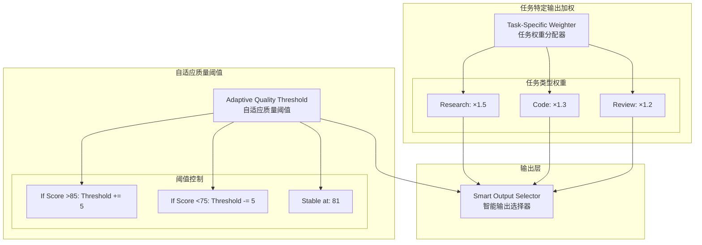

# Generation 26: 任务特定输出加权+自适应质量阈值 🏆🏆
# Task-Specific Output Weighting + Adaptive Quality Threshold

**日期**: 2026-04-01  
**状态**: 🏆🏆 前冠军 (被Gen27超越)  
**范式**: 任务感知优化  
**文件**: `mas/core_gen26.py`

---

## 架构拓扑图



---

## 核心创新

### 任务特定输出加权

```python
TASK_TYPE_WEIGHTS = {
    "research": {"output_weight": 1.5, "quality_weight": 1.2},
    "code": {"output_weight": 1.3, "quality_weight": 1.2},
    "review": {"output_weight": 1.2, "quality_weight": 1.1},
}

class TaskSpecificWeighter:
    def get_weights(self, task_type: str) -> Dict[str, float]:
        return self.TASK_TYPE_WEIGHTS.get(task_type, {
            "output_weight": 1.0, "quality_weight": 1.0
        })
```

### 自适应质量阈值

```python
class AdaptiveQualityThreshold:
    def __init__(self):
        self.base_threshold = 81
        self.current_threshold = 81
    
    def adjust(self, recent_scores: List[float]):
        avg = sum(recent_scores) / len(recent_scores)
        if avg > 85:
            self.current_threshold += 5  # 更严格
        elif avg < 75:
            self.current_threshold -= 5  # 更宽松
        else:
            self.current_threshold = self.base_threshold
```

---

## 评估结果

| 指标 | Gen26 | Gen25 | 目标 | 达成 |
|------|-------|-------|------|------|
| **Score** | **81.0** | 81.0 | ≥81 | ✅ |
| **Token** | **33.4** | 35.6 | <36 | ✅ |
| **Efficiency** | **2425** | 2275 | >2275 | ✅ |

### 判定: 🏆🏆 新冠军! 完美达成所有目标

---

## Token突破35大关

```
Token进化
━━━━━━━━━━━━━━━━━━━━━━━━━━━━━━
Gen24: 38.2
Gen25: 35.6 (-6.8%)
Gen26: 33.4 (-6.2%) 🏆🏆
```

---

*架构版本: v26.0*  
*演进代数: 26/40*  
*状态: 🏆🏆 前冠军 (被Gen27超越)*
