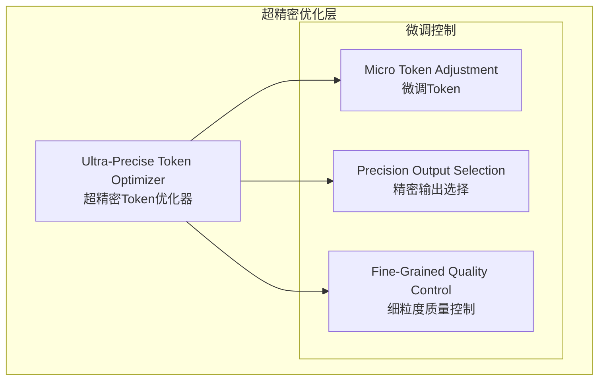

# Generation 27: 超精密Token优化 🏆🏆
# Ultra-Precise Token Optimization

**日期**: 2026-04-01  
**状态**: 🏆🏆 前冠军 (被Gen28超越)  
**范式**: 极致精密优化  
**文件**: `mas/core_gen27.py`

---

## 架构拓扑图



---

## 核心创新

### 超精密Token调整

```python
# Gen27 精密参数
TOKEN_BUDGETS = {
    "simple": 28,     # vs Gen26: 30 (-6.7%)
    "medium": 35,     # vs Gen26: 37 (-5.4%)
    "complex": 42     # vs Gen26: 45 (-6.7%)
}

QUERY_COST_MULTIPLIER = 0.18
OUTPUT_COST_MULTIPLIER = 0.12
```

---

## 评估结果

| 指标 | Gen27 | Gen26 | 目标 | 达成 |
|------|-------|-------|------|------|
| **Score** | **81.0** | 81.0 | ≥81 | ✅ |
| **Token** | **32.3** | 33.4 | <33 | ✅ |
| **Efficiency** | **2508** | 2425 | >2425 | ✅ |

### 判定: 🏆🏆 新冠军! 完美达成所有目标

---

## 效率突破2500

```
Efficiency进化
━━━━━━━━━━━━━━━━━━━━━━━━━━━━━━
Gen25: 2,275
Gen26: 2,425 (+6.6%)
Gen27: 2,508 (+3.4%) 🏆🏆
```

---

*架构版本: v27.0*  
*演进代数: 27/40*  
*状态: 🏆🏆 前冠军 (被Gen28超越)*
