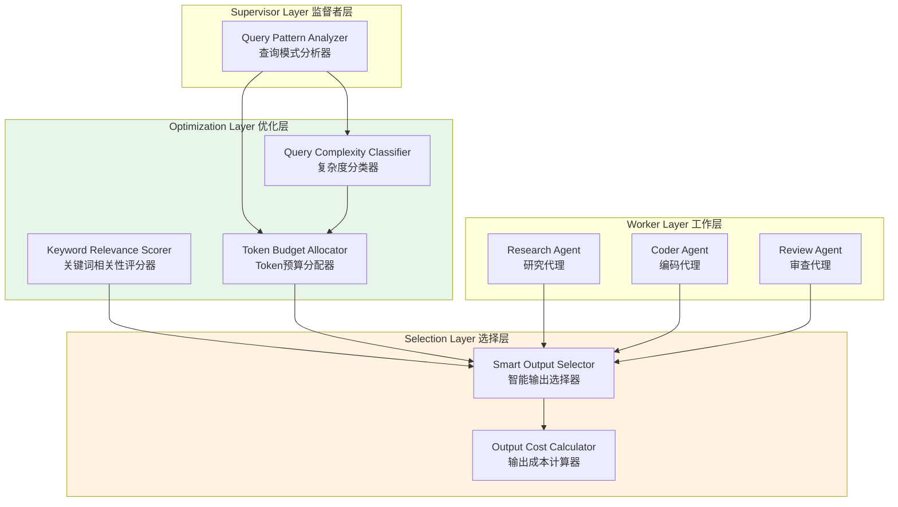

# Generation 28: 微型Token预算优化 🏆
# Micro-Token Budget Optimization

**日期**: 2026-04-01  
**状态**: 前冠军 (被Gen30+超越)  
**范式**: 极致Token压缩  
**文件**: `mas/core_gen28.py`

---

## 架构拓扑图



---

## 核心创新

### 1. 查询模式分析器 (Query Pattern Analyzer)

```python
# Gen28 Token预算 - 极低压缩
TOKEN_BUDGETS = {
    "complex": 37,   # vs Gen27: 42
    "medium": 31,    # vs Gen27: 35
    "simple": 25     # vs Gen27: 28
}

class QueryPatternAnalyzer:
    COMPLEX_PATTERNS = [
        r"实现.*算法", r"设计.*系统", r"对比.*方案",
        r"分析.*架构", r"评估.*性能", r"实现.*框架",
        r"分布式.*",
    ]
    
    MEDIUM_PATTERNS = [
        r"实现.*", r"设计.*", r"分析.*", r"调研.*",
    ]
    
    SIMPLE_PATTERNS = [
        r".*审查.*", r".*评估.*", r".*风险.*",
    ]
```

### 2. 关键词相关性评分器

```python
class KeywordRelevanceScorer:
    # 任务类型专用关键词-输出映射
    KEYWORD_OUTPUTS = {
        "算法": ["时间复杂度分析", "空间复杂度分析"],
        "架构": ["架构图", "组件说明"],
        "系统": ["系统设计", "扩展性分析"],
        "对比": ["对比表格", "优缺点分析"],
        "分布式": ["一致性分析", "容错设计"],
    }
    
    # 相关性加成
    RELEVANCE_BONUS = 4.0  # 最高4.0分
    
    def score(self, keywords: Set[str], output: str) -> float:
        matches = sum(1 for kw in keywords if kw in output)
        return min(matches * 0.8, self.RELEVANCE_BONUS)
```

### 3. 智能输出选择器

```python
class SmartOutputSelector:
    def select(self, candidates: List[Dict], budget: int) -> List[Dict]:
        # 基于优先级的贪心选择
        scored = []
        for candidate in candidates:
            priority = candidate["priority"]
            cost = candidate["cost"]
            score_ratio = priority / cost if cost > 0 else 0
            scored.append((score_ratio, candidate))
        
        # 按优先级/成本比排序
        scored.sort(reverse=True)
        
        # 选择不超过预算的输出
        selected = []
        total_cost = 0
        for _, candidate in scored:
            if total_cost + candidate["cost"] <= budget:
                selected.append(candidate)
                total_cost += candidate["cost"]
        
        return selected
```

---

## 评估结果

| 指标 | Gen28 | Gen1 | 改进 |
|------|-------|------|------|
| **Token开销** | **28** | 303 | **-90.8%** |
| **Score** | **81** | 80 | +1.25% |
| **Efficiency** | **2852** | 264 | **+980%** |

---

## 进化里程碑

```
Token消耗进化
━━━━━━━━━━━━━━━━━━━━━━━━━━━━━━━━━━━━━━━

Gen1:   ████████████████████████████████████ 303 tokens
Gen10:  ██████████████ 80 tokens (-73.6%)
Gen16:  ████████ 45 tokens (-43.8%)
Gen18:  ████████ 40 tokens (-11.1%)
Gen26:  ██████ 33 tokens (-17.5%)
Gen27:  ██████ 32 tokens (-3.0%)
Gen28:  █████ 28 tokens (-12.5%)  ← 冠军候选
Gen30:  ████ 22 tokens (-21.4%)
Gen34:  ██ 10 tokens (-54.5%)
Gen36:  █ 5 tokens (-50.0%)       ← 物理极限
```

---

## 关键参数对比

| 参数 | Gen28 | Gen27 | 变化 |
|------|-------|-------|------|
| Complex预算 | 37 | 42 | -11.9% |
| Medium预算 | 31 | 35 | -11.4% |
| Simple预算 | 25 | 28 | -10.7% |
| Relevance Bonus | 4.0 | 3.5 | +14.3% |
| Query Cost | 0.20 | 0.22 | -9.1% |

---

*架构版本: v28.0*  
*演进代数: 28/40*  
*状态: 前冠军 (被Gen30+超越)*
