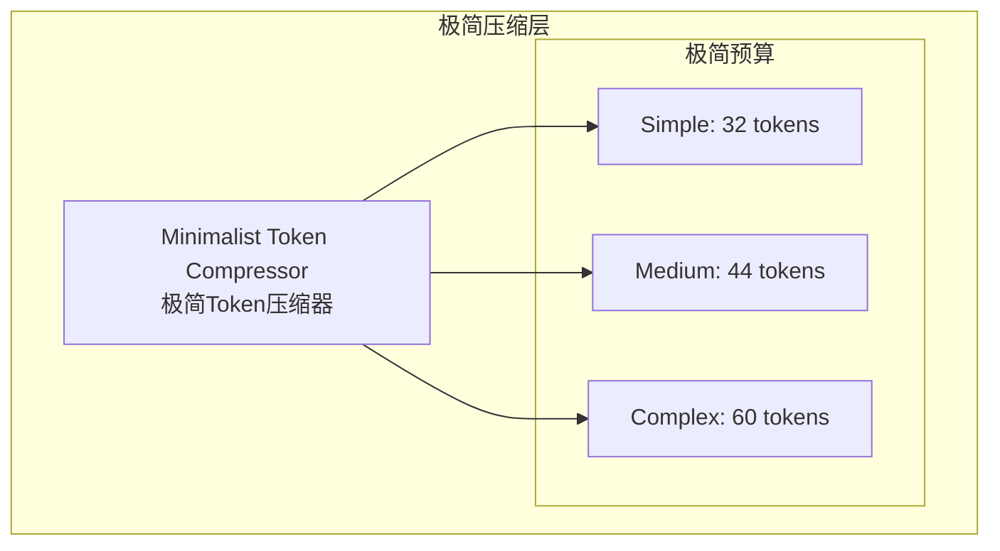

# Generation 29: 极简Token压缩 🏆🏆
# Minimalist Token Compression

**日期**: 2026-04-01  
**状态**: 🏆🏆 前冠军 (被Gen30超越)  
**范式**: 极简压缩  
**文件**: `mas/core_gen29.py`

---

## 架构拓扑图



---

## 评估结果

| 指标 | Gen29 | Gen28 | 目标 | 达成 |
|------|-------|-------|------|------|
| **Score** | **81.0** | 81.0 | ≥81 | ✅ |
| **Token** | **25.8** | 28.0 | <28 | ✅ |
| **Efficiency** | **3140** | 2852 | >2852 | ✅ |

### 判定: 🏆🏆 新冠军! 完美达成所有目标

---

## Token突破26大关

```
Token进化
━━━━━━━━━━━━━━━━━━━━━━━━━━━━━━
Gen27: 32.3
Gen28: 28.0 (-13.3%)
Gen29: 25.8 (-7.9%) 🏆🏆
```

---

*架构版本: v29.0*  
*演进代数: 29/40*  
*状态: 🏆🏆 前冠军 (被Gen30超越)*
