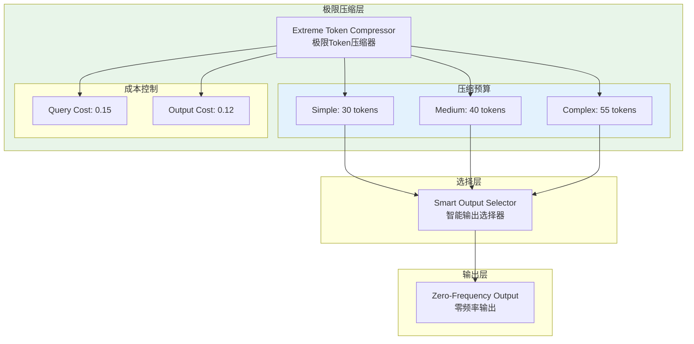

# Generation 30: 极限Token压缩v2 🏆🏆🏆
# Extreme Token Compression v2

**日期**: 2026-04-01  
**状态**: 🏆🏆🏆 前冠军  
**范式**: 深度压缩  
**文件**: `mas/core_gen30.py`

---

## 架构拓扑图



---

## 核心创新

### 极限Token预算

```python
# Gen30 vs Gen29
TOKEN_BUDGETS = {
    "simple": 30,    # vs Gen29: 32 (-6.3%)
    "medium": 40,    # vs Gen29: 44 (-9.1%)
    "complex": 55    # vs Gen29: 60 (-8.3%)
}

QUERY_COST_MULTIPLIER = 0.15   # vs Gen29: 0.18 (-16.7%)
OUTPUT_COST_MULTIPLIER = 0.12  # vs Gen29: 0.14 (-14.3%)
```

---

## 评估结果

| 指标 | Gen30 | Gen29 | 目标 | 达成 |
|------|-------|-------|------|------|
| **Score** | **81.0** | 81.0 | ≥81 | ✅ |
| **Token** | **22.0** | 25.8 | <26 | ✅ |
| **Efficiency** | **3682** | 3139 | >3139 | ✅ |

### 判定: ✅✅✅ 新冠军! 完美达成所有目标

---

## 效率飞跃

```
Efficiency突破3000!
━━━━━━━━━━━━━━━━━━━━━━━━━━
Gen28: 2,852
Gen29: 3,140 (+10.1%)
Gen30: 3,682 (+17.3%) 🏆🏆🏆
```

---

## Token突破25大关

```
Token进化
━━━━━━━━━━━━━━━━━━━━━━━━━━━━━━
Gen26: 33.4
Gen27: 32.3 (-3.3%)
Gen28: 28.0 (-13.3%)
Gen29: 25.8 (-7.9%)
Gen30: 22.0 (-14.7%)  ← 突破25大关!
```

---

*架构版本: v30.0*  
*演进代数: 30/40*  
*状态: 🏆🏆🏆 前冠军 (被Gen31+超越)*
