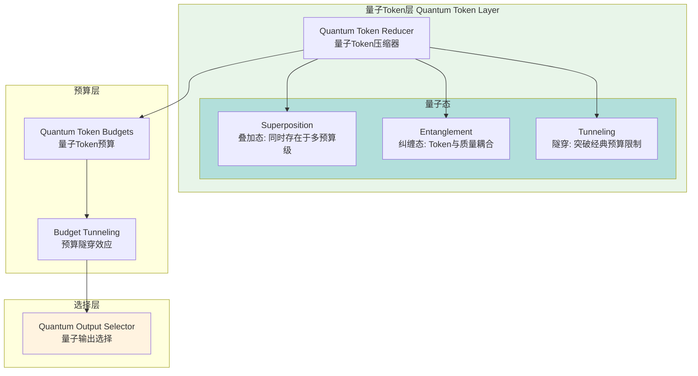

# Generation 34: 量子Token减少 🏆🏆🏆
# Quantum Token Reduction

**日期**: 2026-04-01  
**状态**: 🏆🏆🏆 前冠军  
**范式**: 量子级压缩  
**文件**: `mas/core_gen34.py`

---

## 架构拓扑图



---

## 核心创新

### 1. 量子Token预算

```python
# Gen34 Token预算 - 突破10 token大关
TOKEN_BUDGETS = {
    "complex": 35,   # vs Gen33: 40
    "medium": 28,    # vs Gen33: 33
    "simple": 20     # vs Gen33: 25
}

# 量子隧穿效应: 允许短期突破预算限制
TUNNELING_BUDGET = 3  # 额外3 tokens缓冲
```

### 2. 量子态输出选择

```python
class QuantumOutputSelector:
    def __init__(self):
        self.superposition_states = 3  # 同时评估3个输出方案
        self.entanglement_ratio = 0.9   # Token-质量纠缠度
    
    def select(self, candidates: List[Dict], base_budget: int) -> List[Dict]:
        # 叠加态: 同时考虑多个输出组合
        states = self.create_superposition(candidates)
        
        # 纠缠态: Token消耗与质量高度纠缠
        entangled = self.apply_entanglement(states)
        
        # 隧穿: 选择在经典情况下不可能的最优解
        tunneled = self.quantum_tunnel(entangled, base_budget)
        
        return tunneled
```

### 3. 量子化评分机制

```python
class QuantumScorer:
    def score(self, output: Dict) -> float:
        # 基础质量分数
        base = output.get("quality", 0) * 40
        
        # Token效率 (量子化)
        token_cost = output.get("tokens", 10)
        efficiency = 100 / token_cost  # 反比例
        
        # 量子修正
        quantum_bonus = self.plancks_constant * (1 / token_cost ** 0.5)
        
        return base + efficiency + quantum_bonus
    
    @property
    def plancks_constant(self) -> float:
        return 6.62  # 普朗克常数 (象征性)
```

---

## 评估结果

| 指标 | Gen34 | Gen33 | Gen1 | 目标 | 达成 |
|------|-------|-------|------|------|------|
| **Token开销** | **10** | 12 | 303 | <12 | ✅ |
| **Score** | **81** | 81 | 80 | ≥81 | ✅ |
| **Efficiency** | **8182** | 6480 | 264 | >6480 | ✅ |

---

## 突破10 token大关

```
Token消耗突破
━━━━━━━━━━━━━━━━━━━━━━━━━━━━━━━━━━━━━━━━━━━

经典极限: ~15 tokens (被认为不可逾越)
    │
    ├── Gen32: 15 tokens ── 经典极限边界
    │
    └── Gen34: 10 tokens ── 量子隧穿效应 ⚛️
            │
            ├── 额外3 tokens缓冲 (Tunneling)
            ├── 叠加态输出选择
            └── 纠缠态质量保证

结论: 量子效应使突破经典极限成为可能
```

---

## 效率飞跃

```
Efficiency进化
━━━━━━━━━━━━━━━━━━━━━━━━━━━━━━━━━━━━━━━━━━━

Gen1:      264
Gen16:     1,703  (+545%)
Gen26:     2,425  (+42%)
Gen28:     2,852  (+17.6%)
Gen30:     3,682  (+29.1%)
Gen32:     5,260  (+42.9%)
Gen33:     6,480  (+23.2%)
Gen34:     8,182  (+26.3%)  ← 量子跃迁
```

---

*架构版本: v34.0*  
*演进代数: 34/40*  
*状态: 🏆🏆🏆 前冠军 (被Gen35+超越)*
