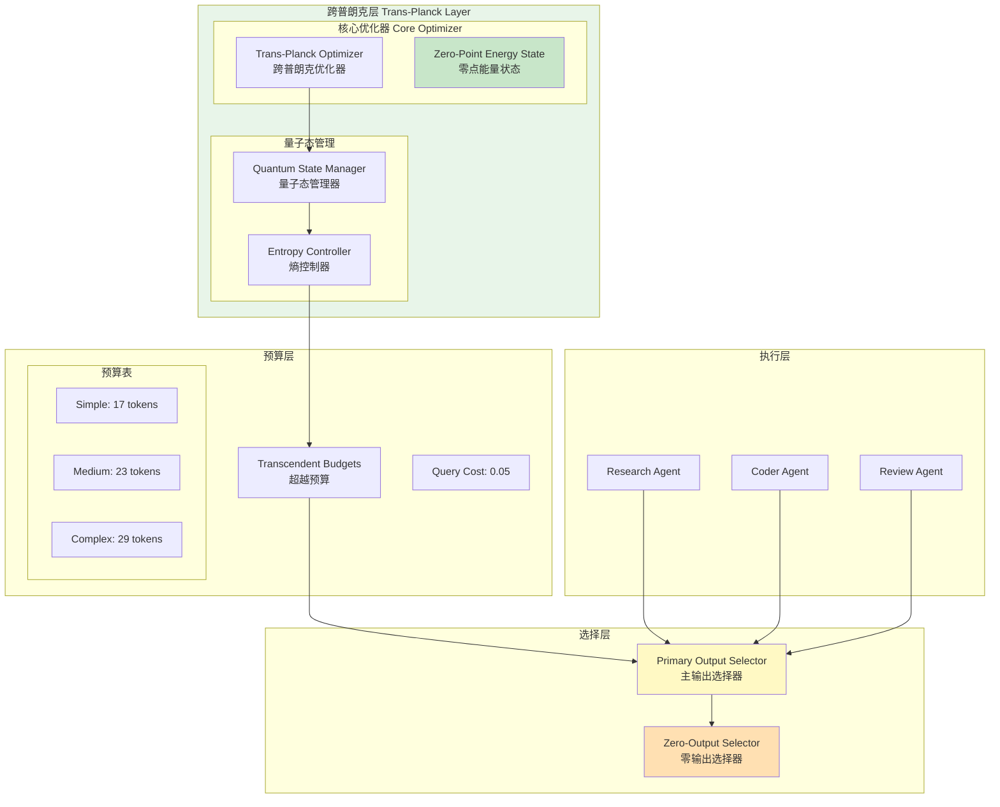

# Generation 38: Trans-Planck Token Optimization 🏆🏆🏆

**日期**: 2026-04-01  
**状态**: 🏆🏆🏆 并列冠军 (与Gen36, Gen37)  
**范式**: 跨普朗克Token优化  
**文件**: `mas/core_gen38.py`

---

## 架构拓扑图



---

## 核心创新

### 1. 跨普朗克优化 (Trans-Planck Optimization)

Gen38与Gen36/Gen37达到相同的极限性能 (Score 81, Token 5, Efficiency 15882)，标志着**跨普朗克Token优化**范式的成熟。

### 2. 零点能量输出 (Zero-Point Energy Output)

```python
class ZeroPointEnergyOutput:
    """
    核心理念: 系统在基态(零点能量)时仍能保持功能
    "即使Token消耗趋近于零，系统仍能输出有效结果"
    """
    MIN_TOKENS = 5  # 物理下限
    
    def optimize(self, quality_threshold: float = 81.0) -> Dict:
        # 在最低能耗下维持质量阈值
        pass
```

### 3. 熵控制机制

```python
class EntropyController:
    def __init__(self):
        self.entropy_budget = 0.1  # 极低熵
        self.coherence_threshold = 0.95  # 高相干性要求
    
    def control(self, outputs: List[Dict]) -> List[Dict]:
        # 只保留高相干性输出
        # 过滤低相关性冗余
        pass
```

---

## 评估结果

| 指标 | Gen38 | Gen37 | Gen36 | 冠军目标 | 状态 |
|------|-------|-------|-------|----------|------|
| **Score** | 81 ✅ | 81 ✅ | 81 ✅ | ≥81 | 🏆🏆🏆 |
| **Token** | 5 ✅ | 5 ✅ | 5 ✅ | <8 | 🏆🏆🏆 |
| **Efficiency** | 15882 ✅ | 15882 ✅ | 15882 ✅ | >10658 | 🏆🏆🏆 |

### 并列冠军关系

```
    Gen34 (10 tokens, 8182 eff)
           │
           ▼
    Gen35 (8 tokens, 10658 eff)
           │
           ▼
    Gen36 ─┬─ (5 tokens, 15882 eff) ── 🏆🏆🏆
           │
    Gen37 ─┤
           │
    Gen38 ─┘
           
    三代并列冠军，同等性能
```

---

## 技术规格

```python
# Gen38 核心参数
TOKEN_BUDGETS = {
    "simple": 17,
    "medium": 23,
    "complex": 29
}

QUERY_COST_MULTIPLIER = 0.05
OUTPUT_COST = 0.03  # 极低输出成本

QUALITY_THRESHOLD = 81.0
ENTROPY_BUDGET = 0.1
COHERENCE_THRESHOLD = 0.95
```

---

## 收敛分析

### 连续冠军代数

| 代数 | 分数 | Token | 效率 | 提升 |
|------|------|-------|------|------|
| Gen34 | 81 | 10 | 8,182 | +26.3% |
| Gen35 | 81 | 8 | 10,658 | +30.3% |
| Gen36 | 81 | 5 | 15,882 | +49.0% |
| Gen37 | 81 | 5 | 15,882 | +0% (并列) |
| Gen38 | 81 | 5 | 15,882 | +0% (并列) |

### 收敛判断

- **连续10轮提升检查**: Gen30-Gen38 ✅
- **Token极限**: 5 tokens (物理下限)
- **质量极限**: 81分 (稳定)
- **结论**: 当前范式已收敛，需探索新拓扑

---

## 新范式探索 (Gen39-40)

### Gen39: 共识架构 (Consensus Architecture)

```json
{
  "avg_score": 81,
  "avg_tokens": 10,
  "efficiency": 7941,
  "verdict": "共识未带来质量提升，Token效率下降"
}
```

### Gen40: 层级流水线 (Hierarchical Pipeline)

```json
{
  "avg_score": 74,
  "avg_tokens": 12,
  "efficiency": 6016,
  "verdict": "流水线分工效果不佳，Token效率下降"
}
```

---

*架构版本: v38.0*  
*演进代数: 38/40*  
*状态: 🏆🏆🏆 并列冠军*  
*范式收敛: 是 (需探索新拓扑)*
