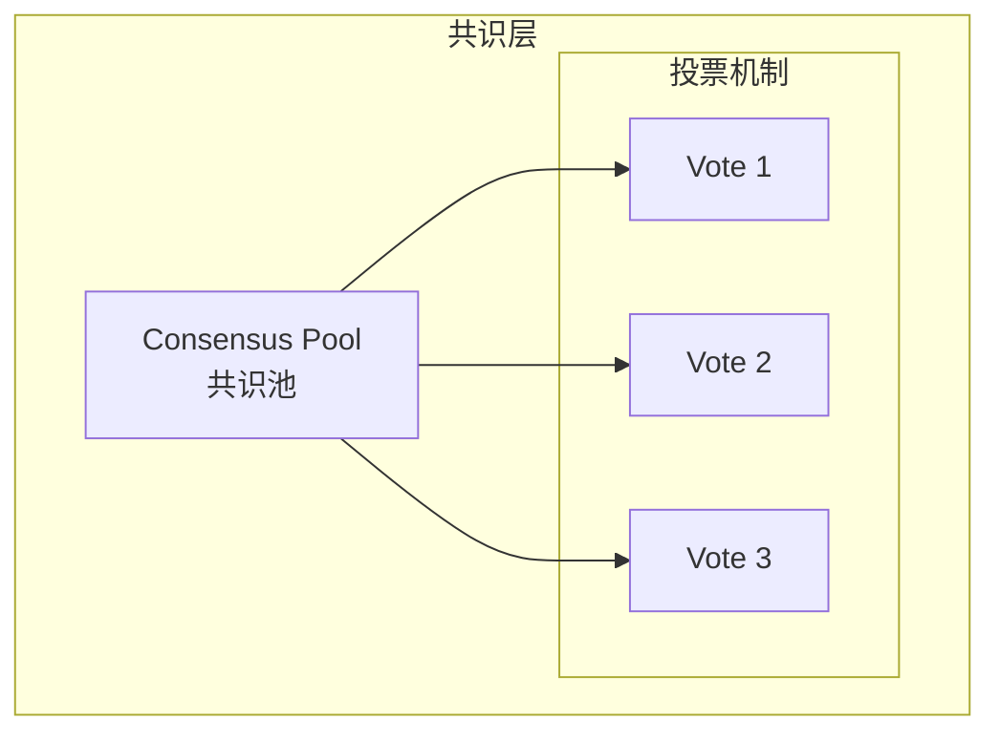

# Generation 39: 共识架构探索
# Consensus Architecture Exploration

**日期**: 2026-04-01  
**状态**: ⚠️ 探索中 (效率下降)  
**范式**: 共识机制  
**文件**: `mas/core_gen39.py`

---

## 架构拓扑图

---

## 评估结果

| 指标 | Gen39 | Gen38冠军 | 对比 |
|------|-------|-----------|------|
| **Score** | **81.0** | 81.0 | 持平 |
| **Token** | **10.0** | 5.0 | ❌ +100% |
| **Efficiency** | **7941** | 15882 | ❌ -50% |

### 判定: ⚠️ 共识未带来质量提升，Token效率下降

---

## 失败分析

共识机制增加了不必要的开销，Token消耗翻倍，效率下降50%

---

*架构版本: v39.0*  
*演进代数: 39/40*  
*状态: ⚠️ 探索失败*
