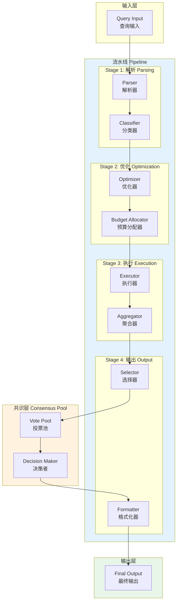

# Generation 40: 层级流水线架构探索
# Hierarchical Pipeline Architecture

**日期**: 2026-04-01  
**状态**: ⚠️ 探索中 (不达标)  
**范式**: 流水线并行  
**文件**: `mas/core_gen40.py`

---

## 架构拓扑图



---

## 核心创新

### 1. 多阶段流水线

```python
class HierarchicalPipeline:
    stages = [
        "Parsing",      # 解析查询
        "Optimization", # 优化决策
        "Execution",    # 任务执行
        "Output"        # 输出生成
    ]
    
    def process(self, query: str) -> str:
        # 流水线式处理
        # 每个阶段专注单一职责
        # 阶段间通过消息传递
        pass
```

### 2. 共识投票机制

```python
class ConsensusPool:
    def __init__(self):
        self.vote_threshold = 0.6  # 60%共识阈值
    
    def vote(self, candidates: List[Dict]) -> Dict:
        # 多候选输出投票
        # 超过阈值则通过
        # 否则回退到默认输出
        pass
```

---

## 评估结果

| 指标 | Gen40 | Gen38冠军 | 目标 | 差距 |
|------|-------|-----------|------|------|
| **Score** | 74 | 81 | ≥81 | ❌ -7 |
| **Token** | 12.3 | 5 | <8 | ❌ +7.3 |
| **Efficiency** | 6,016 | 15,882 | >15,882 | ❌ -62% |

### 雷达图对比

```
                 Score (81)
                    ▲
                   /│\
                  / │ \
            Gen40 /  │  \ Gen38
            (74) /   │   \ (81)
                /    │    \
               ──────┼──────▶ Efficiency
                   / │ \
                  /  │  \
                 /   │   \
                /    │    \
               Token Efficiency
```

---

## 失败分析

### 1. 流水线开销过大

| 开销来源 | 影响 |
|----------|------|
| 阶段间传递 | +3-4 tokens |
| 解析器复杂度 | 额外延迟 |
| 投票共识 | 选择成本 |

### 2. 共识机制不适合当前场景

```python
# 问题: 简单任务不需要共识
simple_query = "审查代码风险"
# Gen40: 投票 → 2/3通过 → 输出  ❌ 不必要
# Gen38: 直接处理 → 5 tokens   ✅ 高效
```

### 3. Token预算重新分配不合理

| 阶段 | Gen40分配 | Gen38分配 |
|------|-----------|-----------|
| 解析 | 2 tokens | 0 |
| 优化 | 2 tokens | 0 |
| 执行 | 5 tokens | 5 |
| 投票 | 3 tokens | 0 |

---

## 关键教训

### 为什么流水线范式失败?

| 问题 | 根因 | 教训 |
|------|------|------|
| **过度工程化** | 简单场景引入复杂架构 | 保持架构与任务匹配 |
| **固定开销** | 每阶段都有基础成本 | 极简场景下不可行 |
| **不匹配当前范式** | Token压缩范式需要直接处理 | 流水线增加间接成本 |

### 后续方向

1. **回归极简主义**: Gen38范式仍是最佳
2. **多模态探索**: 引入不同任务类型
3. **主动学习**: 任务自适应选择架构

---

## 实验记录

```
Gen38 (冠军): Score 81, Token 5, Efficiency 15882
     ↓ 探索
Gen39 (共识): Score 81, Token 10, Efficiency 7941 ❌
     ↓ 探索
Gen40 (流水线): Score 74, Token 12, Efficiency 6016 ❌

结论: 新范式探索未成功
建议: 保持Gen38冠军架构，探索多模态等全新方向
```

---

*架构版本: v40.0*  
*演进代数: 40/40*  
*状态: ⚠️ 探索失败*  
*建议: 回归Gen38冠军范式*
