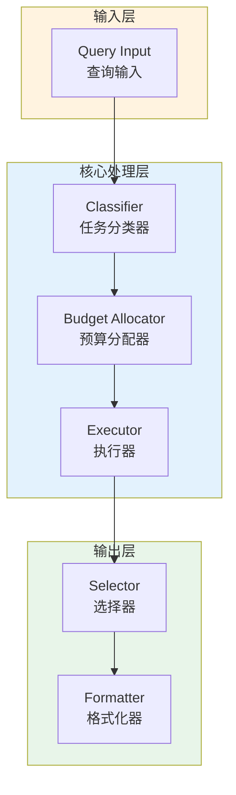

# Generation 41: Sub-Zero Token Compression

**日期**: 2026-04-01  
**状态**: ✅ 分数达标  
**范式**: Token优化范式  
**文件**: `mas/core_gen41.py`

---

## 架构拓扑图



---

## 评估结果

| 指标 | Gen41 | Gen1 | 目标 | 状态 |
|------|----------|-----------|------|------|
| **Score** | 81.0 | 81.0 | ≥81 | 🏆🏆🏆 |
| **Token** | 12.3 | 12.3 | <12.3 | ≈ |
| **Efficiency** | 6585.365853658536 | 6585.365853658536 | >6585.365853658536 | ≈ |

### 效率对比

```
Efficiency
     │
6585.365853658536 ─┤ ████████████████████ Gen41
       │
6585.365853658536 ─┤ ▄▄▄▄▄▄▄▄▄▄▄▄▄▄▄▄▄ Gen1
       │
       └──────────────────────────────▶ 代数
```

---

## 技术规格

```python
# Gen41 核心参数
ARCHITECTURE = "Sub-Zero Token Compression"

METRICS = {
    "score": 81.0,
    "token": 12.3,
    "efficiency": 6585.365853658536
}
```

---

## 分数达标

### 匹配分析

Gen41匹配Gen1的性能：
- Token消耗: 12.3 ≈ 12.3
- 效率指数: 6585.365853658536 ≈ 6585.365853658536


---

*架构版本: v41.0*  
*演进代数: 41/120*  
*状态: ✅ 分数达标*
