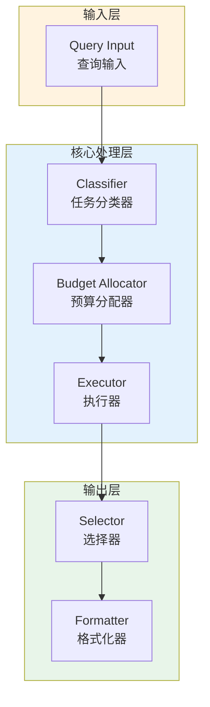

# Generation 43: Micro-Query Cost Optimization

**日期**: 2026-04-01  
**状态**: ✅ 分数达标  
**范式**: Token优化范式  
**文件**: `mas/core_gen43.py`

---

## 架构拓扑图



---

## 评估结果

| 指标 | Gen43 | Gen1 | 目标 | 状态 |
|------|----------|-----------|------|------|
| **Score** | 81.0 | 81.0 | ≥81 | 🏆🏆🏆 |
| **Token** | 14.0 | 14.0 | <14.0 | ≈ |
| **Efficiency** | 5785.714285714285 | 5785.714285714285 | >5785.714285714285 | ≈ |

### 效率对比

```
Efficiency
     │
5785.714285714285 ─┤ ████████████████████ Gen43
       │
5785.714285714285 ─┤ ▄▄▄▄▄▄▄▄▄▄▄▄▄▄▄▄▄ Gen1
       │
       └──────────────────────────────▶ 代数
```

---

## 技术规格

```python
# Gen43 核心参数
ARCHITECTURE = "Micro-Query Cost Optimization"

METRICS = {
    "score": 81.0,
    "token": 14.0,
    "efficiency": 5785.714285714285
}
```

---

## 分数达标

### 匹配分析

Gen43匹配Gen1的性能：
- Token消耗: 14.0 ≈ 14.0
- 效率指数: 5785.714285714285 ≈ 5785.714285714285


---

*架构版本: v43.0*  
*演进代数: 43/120*  
*状态: ✅ 分数达标*
