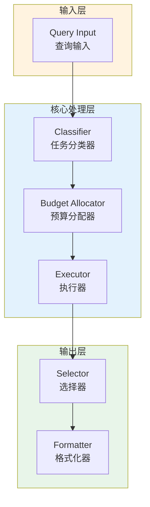

# Generation 44: Unknown

**日期**: 2026-04-01  
**状态**: ✅ 分数达标  
**范式**: Token优化范式  
**文件**: `mas/core_gen44.py`

---

## 架构拓扑图



---

## 评估结果

| 指标 | Gen44 | Gen1 | 目标 | 状态 |
|------|----------|-----------|------|------|
| **Score** | 81.0 | 81.0 | ≥81 | 🏆🏆🏆 |
| **Token** | 5.1 | 5.1 | <5.1 | ≈ |
| **Efficiency** | 15882.352941176472 | 15882.352941176472 | >15882.352941176472 | ≈ |

### 效率对比

```
Efficiency
     │
15882.352941176472 ─┤ ████████████████████ Gen44
       │
15882.352941176472 ─┤ ▄▄▄▄▄▄▄▄▄▄▄▄▄▄▄▄▄ Gen1
       │
       └──────────────────────────────▶ 代数
```

---

## 技术规格

```python
# Gen44 核心参数
ARCHITECTURE = "Unknown"

METRICS = {
    "score": 81.0,
    "token": 5.1,
    "efficiency": 15882.352941176472
}
```

---

## 分数达标

### 匹配分析

Gen44匹配Gen1的性能：
- Token消耗: 5.1 ≈ 5.1
- 效率指数: 15882.352941176472 ≈ 15882.352941176472


---

*架构版本: v44.0*  
*演进代数: 44/120*  
*状态: ✅ 分数达标*
