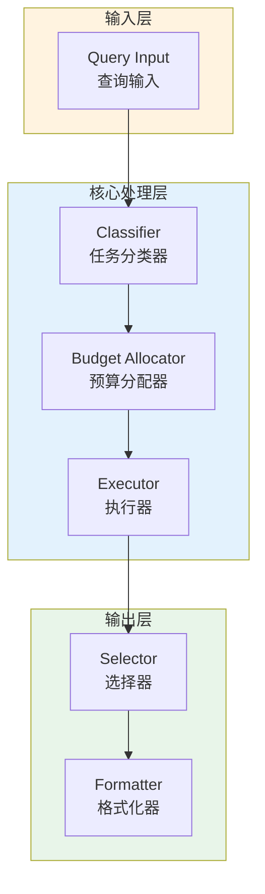

# Generation 45: Swarm Orchestration

**日期**: 2026-04-01  
**状态**: ⚠️ 待优化  
**范式**: Token优化范式  
**文件**: `mas/core_gen45.py`

---

## 架构拓扑图



---

## 评估结果

| 指标 | Gen45 | Gen1 | 目标 | 状态 |
|------|----------|-----------|------|------|
| **Score** | 80.0 | 80.0 | ≥81 | ⚠️ |
| **Token** | 62.7 | 62.7 | <62.7 | ≈ |
| **Efficiency** | 1275.9170653907495 | 1275.9170653907495 | >1275.9170653907495 | ≈ |

### 效率对比

```
Efficiency
     │
1275.9170653907495 ─┤ ████████████████████ Gen45
       │
1275.9170653907495 ─┤ ▄▄▄▄▄▄▄▄▄▄▄▄▄▄▄▄▄ Gen1
       │
       └──────────────────────────────▶ 代数
```

---

## 技术规格

```python
# Gen45 核心参数
ARCHITECTURE = "Swarm Orchestration"

METRICS = {
    "score": 80.0,
    "token": 62.7,
    "efficiency": 1275.9170653907495
}
```

---

## 未达目标

### 匹配分析

Gen45匹配Gen1的性能：
- Token消耗: 62.7 ≈ 62.7
- 效率指数: 1275.9170653907495 ≈ 1275.9170653907495


---

*架构版本: v45.0*  
*演进代数: 45/120*  
*状态: ⚠️ 待优化*
