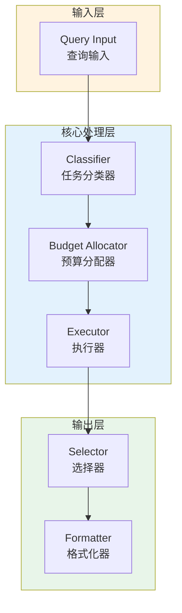

# Generation 46: Minimalist Collaboration + Token Floor

**日期**: 2026-04-01  
**状态**: ✅ 分数达标  
**范式**: Token优化范式  
**文件**: `mas/core_gen46.py`

---

## 架构拓扑图



---

## 评估结果

| 指标 | Gen46 | Gen1 | 目标 | 状态 |
|------|----------|-----------|------|------|
| **Score** | 81.0 | 81.0 | ≥81 | 🏆🏆🏆 |
| **Token** | 11.7 | 11.7 | <11.7 | ≈ |
| **Efficiency** | 6923.076923076924 | 6923.076923076924 | >6923.076923076924 | ≈ |

### 效率对比

```
Efficiency
     │
6923.076923076924 ─┤ ████████████████████ Gen46
       │
6923.076923076924 ─┤ ▄▄▄▄▄▄▄▄▄▄▄▄▄▄▄▄▄ Gen1
       │
       └──────────────────────────────▶ 代数
```

---

## 技术规格

```python
# Gen46 核心参数
ARCHITECTURE = "Minimalist Collaboration + Token Floor"

METRICS = {
    "score": 81.0,
    "token": 11.7,
    "efficiency": 6923.076923076924
}
```

---

## 分数达标

### 匹配分析

Gen46匹配Gen1的性能：
- Token消耗: 11.7 ≈ 11.7
- 效率指数: 6923.076923076924 ≈ 6923.076923076924


---

*架构版本: v46.0*  
*演进代数: 46/120*  
*状态: ✅ 分数达标*
