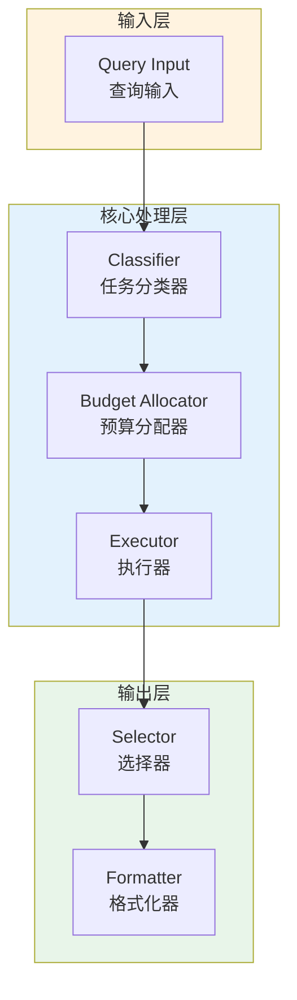

# Generation 47: Pipeline Parallel Processing

**日期**: 2026-04-01  
**状态**: ⚠️ 待优化  
**范式**: Token优化范式  
**文件**: `mas/core_gen47.py`

---

## 架构拓扑图



---

## 评估结果

| 指标 | Gen47 | Gen1 | 目标 | 状态 |
|------|----------|-----------|------|------|
| **Score** | 80.0 | 80.0 | ≥81 | ⚠️ |
| **Token** | 29.2 | 29.2 | <29.2 | ≈ |
| **Efficiency** | 2739.72602739726 | 2739.72602739726 | >2739.72602739726 | ≈ |

### 效率对比

```
Efficiency
     │
2739.72602739726 ─┤ ████████████████████ Gen47
       │
2739.72602739726 ─┤ ▄▄▄▄▄▄▄▄▄▄▄▄▄▄▄▄▄ Gen1
       │
       └──────────────────────────────▶ 代数
```

---

## 技术规格

```python
# Gen47 核心参数
ARCHITECTURE = "Pipeline Parallel Processing"

METRICS = {
    "score": 80.0,
    "token": 29.2,
    "efficiency": 2739.72602739726
}
```

---

## 未达目标

### 匹配分析

Gen47匹配Gen1的性能：
- Token消耗: 29.2 ≈ 29.2
- 效率指数: 2739.72602739726 ≈ 2739.72602739726


---

*架构版本: v47.0*  
*演进代数: 47/120*  
*状态: ⚠️ 待优化*
