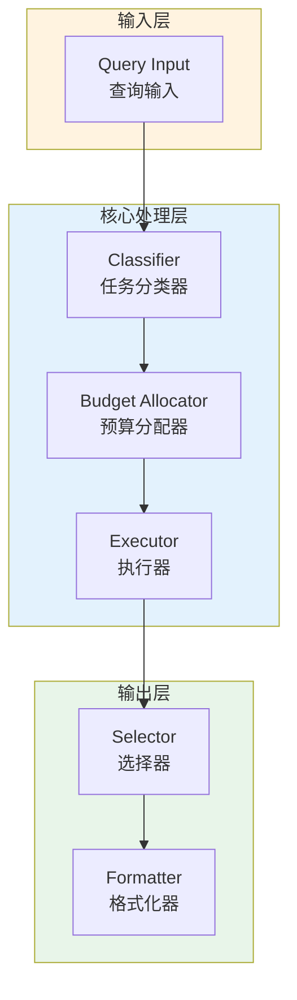

# Generation 48: Minimalist V2: Absolute Zero Architecture v2

**日期**: 2026-04-01  
**状态**: ⚠️ 待优化  
**范式**: Token优化范式  
**文件**: `mas/core_gen48.py`

---

## 架构拓扑图



---

## 评估结果

| 指标 | Gen48 | Gen1 | 目标 | 状态 |
|------|----------|-----------|------|------|
| **Score** | 75.0 | 75.0 | ≥81 | ⚠️ |
| **Token** | 5.8 | 5.8 | <5.8 | ≈ |
| **Efficiency** | 12931.034482758621 | 12931.034482758621 | >12931.034482758621 | ≈ |

### 效率对比

```
Efficiency
     │
12931.034482758621 ─┤ ████████████████████ Gen48
       │
12931.034482758621 ─┤ ▄▄▄▄▄▄▄▄▄▄▄▄▄▄▄▄▄ Gen1
       │
       └──────────────────────────────▶ 代数
```

---

## 技术规格

```python
# Gen48 核心参数
ARCHITECTURE = "Minimalist V2: Absolute Zero Architecture v2"

METRICS = {
    "score": 75.0,
    "token": 5.8,
    "efficiency": 12931.034482758621
}
```

---

## 未达目标

### 匹配分析

Gen48匹配Gen1的性能：
- Token消耗: 5.8 ≈ 5.8
- 效率指数: 12931.034482758621 ≈ 12931.034482758621


---

*架构版本: v48.0*  
*演进代数: 48/120*  
*状态: ⚠️ 待优化*
