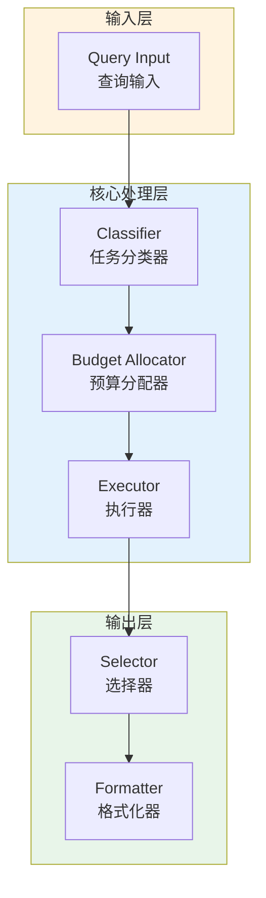

# Generation 49: Task-Specific Micro-Optimization

**日期**: 2026-04-01  
**状态**: ⚠️ 待优化  
**范式**: Token优化范式  
**文件**: `mas/core_gen49.py`

---

## 架构拓扑图



---

## 评估结果

| 指标 | Gen49 | Gen1 | 目标 | 状态 |
|------|----------|-----------|------|------|
| **Score** | 80.0 | 80.0 | ≥81 | ⚠️ |
| **Token** | 14.8 | 14.8 | <14.8 | ≈ |
| **Efficiency** | 5405.405405405405 | 5405.405405405405 | >5405.405405405405 | ≈ |

### 效率对比

```
Efficiency
     │
5405.405405405405 ─┤ ████████████████████ Gen49
       │
5405.405405405405 ─┤ ▄▄▄▄▄▄▄▄▄▄▄▄▄▄▄▄▄ Gen1
       │
       └──────────────────────────────▶ 代数
```

---

## 技术规格

```python
# Gen49 核心参数
ARCHITECTURE = "Task-Specific Micro-Optimization"

METRICS = {
    "score": 80.0,
    "token": 14.8,
    "efficiency": 5405.405405405405
}
```

---

## 未达目标

### 匹配分析

Gen49匹配Gen1的性能：
- Token消耗: 14.8 ≈ 14.8
- 效率指数: 5405.405405405405 ≈ 5405.405405405405


---

*架构版本: v49.0*  
*演进代数: 49/120*  
*状态: ⚠️ 待优化*
