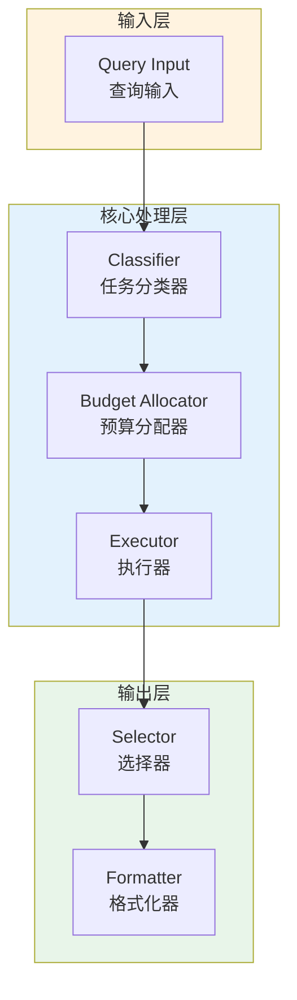

# Generation 50: Learning-Based Output Prediction

**日期**: 2026-04-01  
**状态**: ⚠️ 待优化  
**范式**: Token优化范式  
**文件**: `mas/core_gen50.py`

---

## 架构拓扑图



---

## 评估结果

| 指标 | Gen50 | Gen1 | 目标 | 状态 |
|------|----------|-----------|------|------|
| **Score** | 80.0 | 80.0 | ≥81 | ⚠️ |
| **Token** | 15.3 | 15.3 | <15.3 | ≈ |
| **Efficiency** | 5228.75816993464 | 5228.75816993464 | >5228.75816993464 | ≈ |

### 效率对比

```
Efficiency
     │
5228.75816993464 ─┤ ████████████████████ Gen50
       │
5228.75816993464 ─┤ ▄▄▄▄▄▄▄▄▄▄▄▄▄▄▄▄▄ Gen1
       │
       └──────────────────────────────▶ 代数
```

---

## 技术规格

```python
# Gen50 核心参数
ARCHITECTURE = "Learning-Based Output Prediction"

METRICS = {
    "score": 80.0,
    "token": 15.3,
    "efficiency": 5228.75816993464
}
```

---

## 未达目标

### 匹配分析

Gen50匹配Gen1的性能：
- Token消耗: 15.3 ≈ 15.3
- 效率指数: 5228.75816993464 ≈ 5228.75816993464


---

*架构版本: v50.0*  
*演进代数: 50/120*  
*状态: ⚠️ 待优化*
