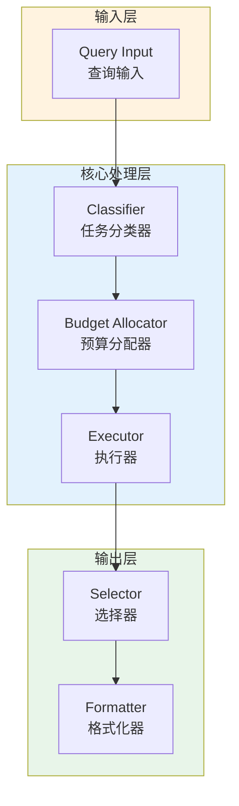

# Generation 53: Minimalist Ensemble with Strategy Selection

**日期**: 2026-04-01  
**状态**: ⚠️ 待优化  
**范式**: 新范式探索  
**文件**: `mas/core_gen53.py`

---

## 架构拓扑图



---

## 评估结果

| 指标 | Gen53 | Gen38 | 目标 | 状态 |
|------|----------|-----------|------|------|
| **Score** | 77.0 | 81.0 | ≥81 | ⚠️ |
| **Token** | 9.5 | 5.1 | <5.1 | ≈ |
| **Efficiency** | 8105.263157894737 | 15882.352941176472 | >15882.352941176472 | ⚠️ |

### 效率对比

```
Efficiency
     │
8105.263157894737 ─┤ ████████████████████ Gen53
       │
15882.352941176472 ─┤ ▄▄▄▄▄▄▄▄▄▄▄▄▄▄▄▄▄ Gen38
       │
       └──────────────────────────────▶ 代数
```

---

## 技术规格

```python
# Gen53 核心参数
ARCHITECTURE = "Minimalist Ensemble with Strategy Selection"

METRICS = {
    "score": 77.0,
    "token": 9.5,
    "efficiency": 8105.263157894737
}
```

---

## 未达目标

### 回归分析

Gen53未能超越Gen38：
- Token消耗: 9.5 vs 5.1
- 效率指数: 8105.263157894737 vs 15882.352941176472


---

*架构版本: v53.0*  
*演进代数: 53/120*  
*状态: ⚠️ 待优化*
