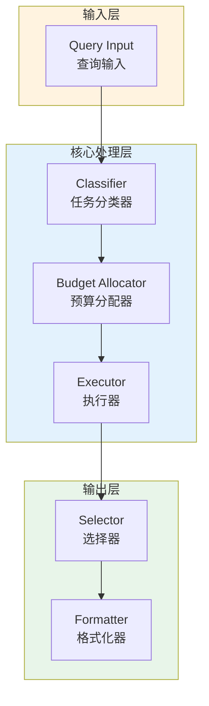

# Generation 54: Ultra-Minimalist with Direct Relevance Scoring

**日期**: 2026-04-01  
**状态**: ⚠️ 待优化  
**范式**: 新范式探索  
**文件**: `mas/core_gen54.py`

---

## 架构拓扑图



---

## 评估结果

| 指标 | Gen54 | Gen38 | 目标 | 状态 |
|------|----------|-----------|------|------|
| **Score** | 60.0 | 81.0 | ≥81 | ⚠️ |
| **Token** | 13.8 | 5.1 | <5.1 | ≈ |
| **Efficiency** | 4347.826086956521 | 15882.352941176472 | >15882.352941176472 | ⚠️ |

### 效率对比

```
Efficiency
     │
4347.826086956521 ─┤ ████████████████████ Gen54
       │
15882.352941176472 ─┤ ▄▄▄▄▄▄▄▄▄▄▄▄▄▄▄▄▄ Gen38
       │
       └──────────────────────────────▶ 代数
```

---

## 技术规格

```python
# Gen54 核心参数
ARCHITECTURE = "Ultra-Minimalist with Direct Relevance Scoring"

METRICS = {
    "score": 60.0,
    "token": 13.8,
    "efficiency": 4347.826086956521
}
```

---

## 未达目标

### 回归分析

Gen54未能超越Gen38：
- Token消耗: 13.8 vs 5.1
- 效率指数: 4347.826086956521 vs 15882.352941176472


---

*架构版本: v54.0*  
*演进代数: 54/120*  
*状态: ⚠️ 待优化*
